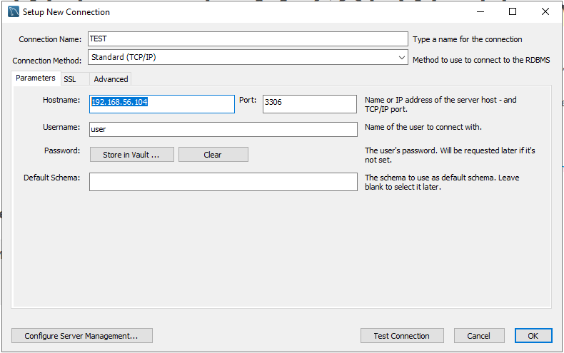

# 20190604

### 외부에서 DB 서버에 접속하기

1. MariaDB
   * 설치 시, root가 외부에서 접속, 방화벽 등록 체크

2. SQL Server

   1. Port 허용(1433)
   
   
   
   
   
   
   
   
   
   
   
   
   
   
   
   
   2. 인증모드 변경(windows/ SQL) 및 SA 사용자 허용
   
     
   
   
   
   
   
   
   
    
   
   
   
   
   
   
   
   
   
   3. TCP(인터넷)을 통해서 접속 허용 ( = IP 주소로 접속 허용)
   
   
   
   
    
   
   
   
   
   
   
   
   
   
   
   
   
   
   
   
   
   
   
   
   
   
   
   
3. Local 설정

   * HeildiSQL 설치

   

   

   

   

   

   

   

   

   

### Python 설치

### Pycharm 설치

* <https://www.jetbrains.com/pycharm/download/#section=windows>
* Pycharm 설치 전, Python 설치 - Pycharm에는 Python이 포함돼있지 않다

---

* Program

* Process

  잠자는 상태의 program을 메모리로 활성화시킨 상태

  동일한 program은 여러번 메모리로 활성화될 수 있는데 CPU가 이름표(process id)를 붙여서 식별

  

* Foregroud

  실행을 하면 화면에 보이는 process 

  ex ) office 365

  

* Backgroud

  실행은 했으나 화면에 안보이는 process → (대부분의) 서비스

* 컴파일러 언어 : C/ C++/ JAVA

  소스 코드를 실행 가능한 기계어로 일괄 번역한 후 완료된 파일(.exe, .class)을 실행하는 언어

  

* 인터프리터 언어 : Python/ JavaScript, Perl

  소스 코드를 한 줄씩 읽어 실행되어 별도의 실행 파일이 생성되지 않는데, 이때 한 줄씩 처리하는 프로그램을 **인터프리터**라고 한다

---

**MISSION**

0. Windows Server 2019 ISO, SQL Server 2017 Express, MySQL 8.0.x 다운

0. Virtual Box에 Win2019 설치하고 설정 → 스냅샷

0. Win2019에 SQL2019, MySQL8.0 설치 후 설정 → 스냅샷

0. Win2019에 Python 3.6과 Pycharm 설치 후 Hello World 작성 → 스냅샷

0. PC의 HeidiSQL에서 SQL 2019, MySQL 8.0 접속

   * port 확인

     

     

   * 계정 생성

     

     

   * 연결확인

     

     

     

   * 네트워크 설정 후 다시 확인

     

     

     

     

   * 외부에서 접속

     