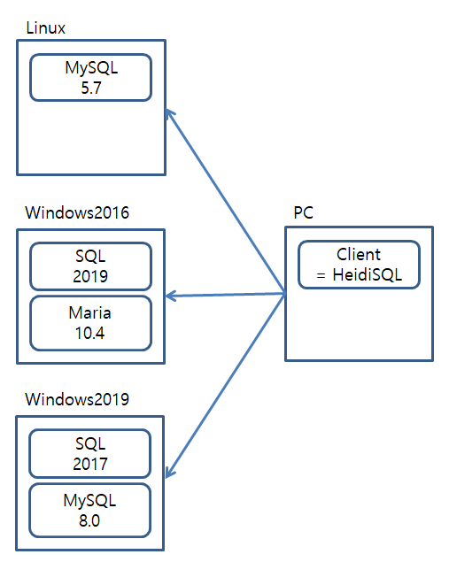
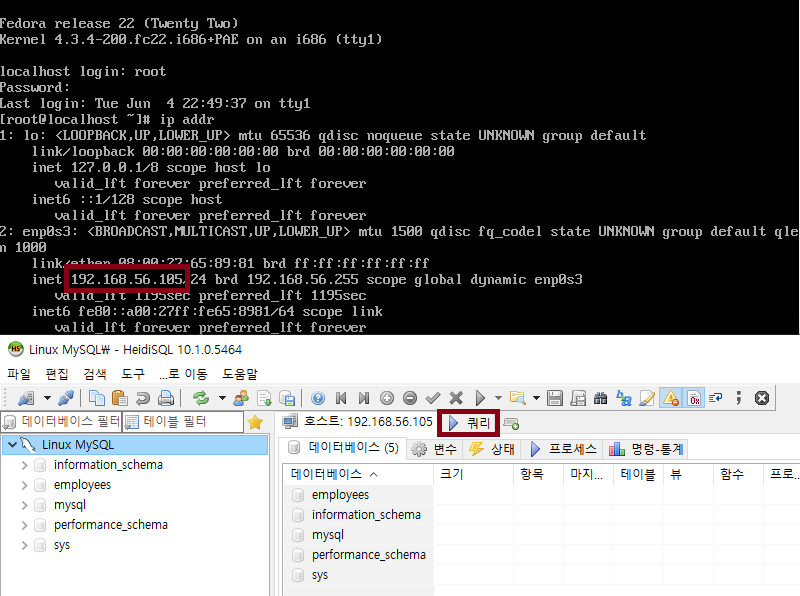
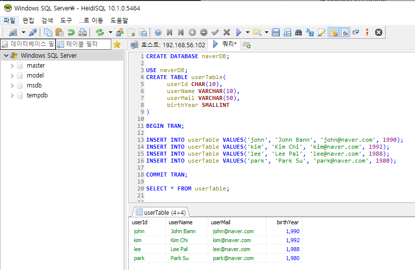
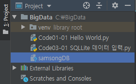
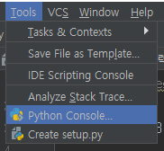
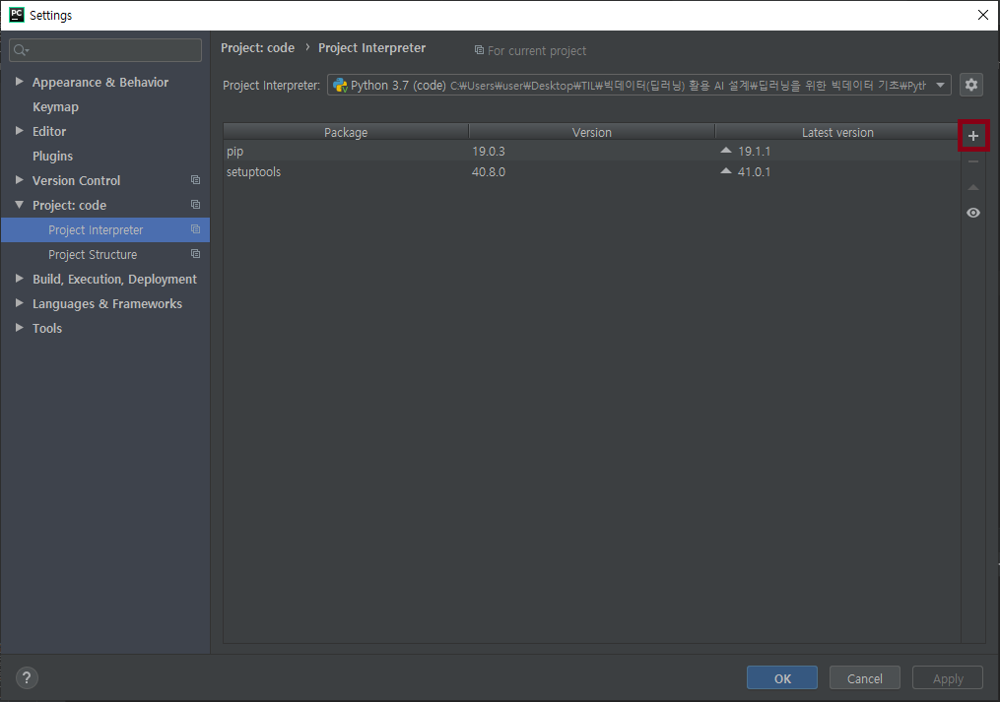
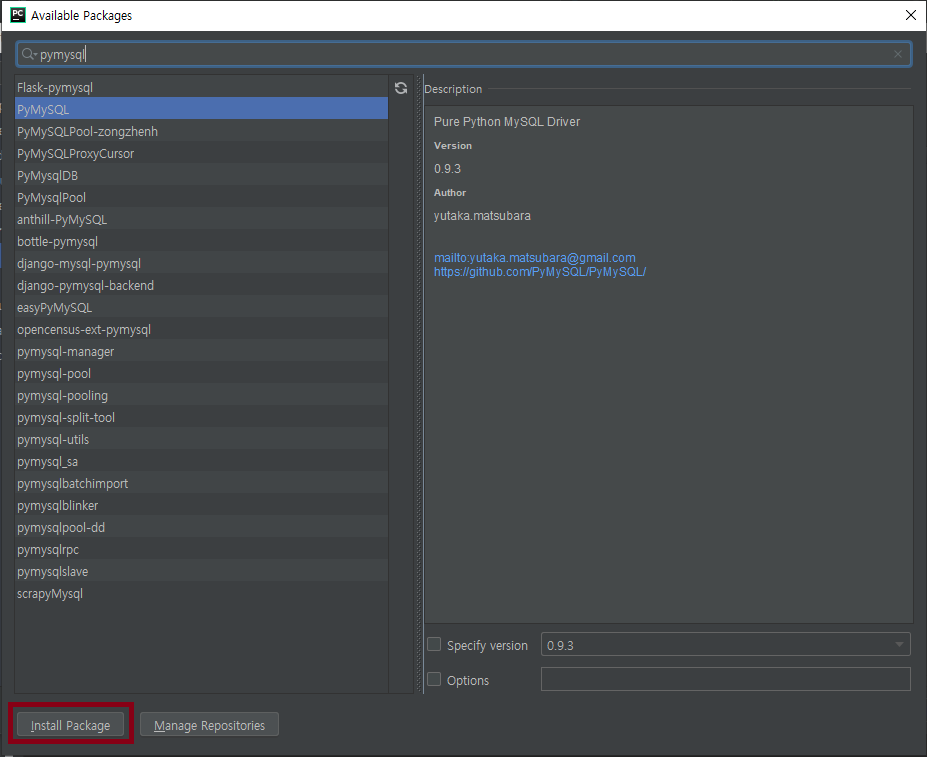
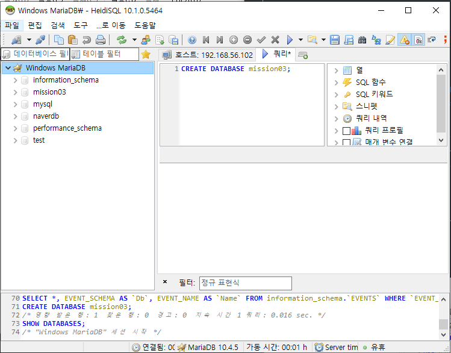
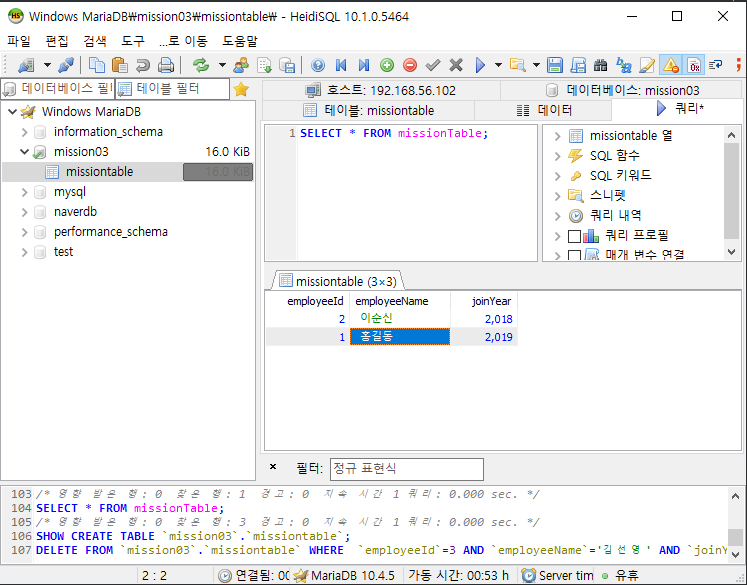

# 20190605

### Review




##### 파이썬 for Beginner P.421

### 데이터베이스  DataBase

Data의 저장소

* **Data** 

  처리되기 전의 자료( 처리 후 → **정보** ), 단편적인 자료

  
  
* Table

  데이터를 저장하기 위한 구성

  

* Row = record, 행, tuple

  행의 개수 = 데이터의 개수

  

* Column = field, 열

  어떤 data를 입력할지 data type이 정해져 있다 - 숫자형, 날짜형, ...

  이름column name이 존재한다

  어떤 DBMS에서는 예약어를 열이름으로 허용하는 DMBS가 있고 아닌 DBMS가 있다 - *예약어를 열이름으로 쓰지 말자*

  

* **DBMS** DataBase Magement System

  DB를 관리하는 프로그램

  

* **Primary Key 기본키**

  기본키의 기본 조건 : **중복 X**, **Not NULL**

  1 table, 1 primary key

  * Candidate Key **후보키** = primary key가 될 수 있는 후보

  * Unique key 고유키 

    중복 X, NULL 허용, 중복되면 안되는 data

    기본키도 고유키의 종류이다

    

* **SQL** Structured Query Language 구조화된 질의 언어

  DBMS와 소통하는 언어 = query

  

* DDL Data Definition Language 데이터 정의어

  * create

  * drop

    table 삭제

  * alter

    table 변경

  

* DML Data Manipulation Language 데이터 조작어

  * insert

  * delete

  * update

  * **select**

    조건에 맞는 data를 검색하는 명령어


### 데이터베이스 설계



```sql
CREATE DATABASE samsongDB; # 여러번 실행할 시 이미 존재하므로 error

USE samsongDB; # 작업할 DB 선택
CREATE TABLE userTable(# table 생성
		userId CHAR(10), 
		userName CHAR(5), # 고정길이 data type, 접근속도가 더 빠르다
		userMail VARCHAR(50), # 가변길이 data type
		birthYear SMALLINT # smallint = 2byte, int = 4byte 
)

INSERT INTO userTable VALUES('AAA', '에이', 'aa@aa.com', 1995);
INSERT INTO userTable VALUES('BBB', '비', 'bb@bb.com', 1991);
INSERT INTO userTable VALUES('CCC', '씨', 'cc@cc.com', 1988);

COMMIT; # DB 저장 확정

SELECT * FROM userTable; # * = 전체 
SELECT * FROM userTable WHERE userID = 'BBB';
SELECT userName, userMail FROM userTable WHERE userID = 'BBB'; # userName, userMail col만 조회
SELECT userName, birthYear FROM userTable WHERE birthYear < 1990;
```

---

### Quiz

1. Window Server의 MariaDB 또는 MySQL에 P.423 구현
2. SQL Server에 P.423 구현하기



---

### Python sqlite3

```python
#Code03-01 SQLite 데이터 입력.py
#파이썬 for Beginner P.429

import sqlite3
conn = sqlite3.connect("samsongDB") # 1. DB 연결 (연결자 생성) 있으면 open, 없으면 create
cur = conn.cursor() # 2. cursor 생성(트럭, 연결 로프, 왔다갔다 하면서 데이터를 옮겨줌)
sql = "CREATE TABLE IF NOT EXISTS userTable(userid INT, userNae CHAR(5));"
cur.execute(sql)

sql = "INSERT INTO userTABLE VALUES(1, '홍길동');"
cur.execute(sql)

sql = "INSERT INTO userTABLE VALUES(2, '이순신');"
cur.execute(sql)

cur.close()
conn.commit()
conn.close() # 6. DB 닫기 (= 연결 해제)
print("OK")
```



```python
#Code03-02 SQLite 데이터 조회.py
#파이썬 for Beginner P.433

import sqlite3

conn = sqlite3.connect("samsongDB") # 1. DB 연결
cur = conn.cursor() # 2. cursor 생성
sql = "SELECT * FROM userTable;"
cur.execute(sql) # cursor가 data를 싣고옮

rows = cur.fetchall() # cur의 data 전체를 rows에 대입
print(rows) #[(1, '홍길동'), (2, '이순신')]

cur.close()
conn.close() # 6. DB 닫기 (= 연결 해제)
```

---

##### 파이썬 for Beginner P.34



```python
Python 3.7.3 (v3.7.3:ef4ec6ed12, Mar 25 2019, 22:22:05) [MSC v.1916 64 bit (AMD64)] on win32
>>> a = 100 # Left.V(= 변수) = Right.V(= 변수, 숫자, 수식, ...)
>>> b = 200 # RAM의 b라는 변수(data 저장공간) 안에 200을 담는다 
>>> a = b
```

* Data type

  * 정수 integer
  * 실수 float
  * 문자열 string
  * 불  bool

  다른 언어 : 변수 만들건데 int형이니까 int만 넣어

  python : 변수 안에 뭔가 왔는데  int네 - 유연성↑, error ↑

```python
>>> type(a)
<class 'int'>
>>> a = "HI"
>>> type(a)
<class 'str'>
```

* 변수 출력

```python
>>> print(a)
HI
>>> print(b)
400
>>> print(a, b)
HI 400
```


##### 파이썬 for Beginner P.34 간단한 계산기

```python
#Code03-03 계산기1.py
a = 100
b = 200

result = a + b
print(a , " + ", b, " = ", result)

result = a - b
print(a , " - ", b, " = ", result)

a = input() # keyboard로 입력받는 함수, input값은 string 변수
b = input()

result = a + b # TypeError: unsupported operand type(s) for -: 'str' and 'str'
print(a , " + ", b, " = ", result)

result = a - b
print(a , " - ", b, " = ", result)
```

```python
#Code03-03 계산기1.py
a = int(input("숫자 1 = "))
b = int(input("숫자 2 = "))

result = a + b
print(a , " + ", b, " = ", result)

result = a - b
print(a , " - ", b, " = ", result)
```

##### 파이썬 for Beginner P.65 format함수

```python
>>> print(100, 200)
100 200
>>> print("%d %d" % (100, 200)) # % 는 구분자, %를 기준으로 개수가 같아야함
100 200
>>> print("%f %f" % (100, 200)) # 값에 영향 X, 출력 형식만 변경
100.000000 200.000000 
>>> print("{} {}".format(100, 200))
100 200
>> print("{0} {1}".format(100, 200)) # {0} : 0번째 
100 200
>>> print("{1} {0}".format(100, 200))
200 100
>>> print("{1:d} {0:f}".format(100, 200)) # 1번째를 정수 형태로, 2번째를 실수형태로 출력
200 100.000000
```

##### 파이썬 for Beginner P.65 이스케이프 문자
```python
>>> print("안녕\n하세요") 
안녕
하세요
```

##### 파이썬 for Beginner P.71 연속된 대입

```python
>>> a = b = 100 # 뒤에서부터 앞으로, 100을 b에 넣고, b를 a 대입
```

##### 파이썬 for Beginner P.93 산술 연산자

```python
>>> 10//3 # 나누기(몫)
3
>>> 10%3 # 나머지값
1
>>> 10**3 # 제곱
1000
```

##### 파이썬 for Beginner P.95 대입연산자

```python
>>> a = 100
>>> a =+ 1 # a = +1
>>> a
1
```

##### 파이썬 for Beginner P.95 동전교환기


```python
#Code03-04 동전 교환.py
## 함수 선언부 ##

## 변수 선언부 ##
money = 0 # 초기화를 선언처럼 사용
#c500, c100, c50, c10 = 0, 0, 0, 0 # python스러운 code
c500, c100, c50, c10 = [0] * 4 # 동전 500, 동전 100, ...

## main 코드부 ##
if __name__ == '__main__':
    money = int(input("바꿀 돈 = "))
    c500 = money // 500;	money %= 500
    c100 = money // 100;	money %= 100
    c50 = money // 50;	money %= 50
    c10 = money // 10;	money %= 10

    print("500원은 ", c500, "100원은 ", c100, "50원은 ", c50, "10원은 ", c10, " 나머지 : ", money)

```
---

### Quiz

입력한 돈을 최소한 지폐, 동전으로 바꾸기

```python
## 함수 선언부 ##

## 변수 선언부 ##
money = 0
c500, c100, c50, c10 = [0] * 4
b50000, b10000, b5000, b1000 = [0] * 4

## main 코드부 ##
if __name__ == '__main__':
    money = int(input("바꿀 돈 = "))

    b50000 = money // 50000;    money %= 50000
    b10000 = money // 10000;    money %= 10000
    b5000 = money // 5000;  money %= 5000
    b1000 = money // 1000;  money %= 1000

    c500 = money // 500;    money %= 500
    c100 = money // 100;    money %= 100
    c50 = money // 50;  money %= 50
    c10 = money // 10;  money %= 10

    print("50000원 지폐는", b50000, "10000원 지폐는", b10000, "5000원 지폐는", b5000, "1000원 지폐는", b1000)
    print("500원은", c500, "100원은", c100, "50원은", c50, "10원은", c10, "나머지 :", money)

```

##### 파이썬 for Beginner P.127 삼항연산자

```python
>>> score = 70
>>> res = "합격" if score >= 60 else "불합격"
>>> res
'합격'
```

##### 파이썬 for Beginner P.129 - 130  if 문

```python
>>> fruit = ["사과", "딸기", "배", "포도"]
>>> fruit
['사과', '딸기', '배', '포도']
>>> if "딸기" in fruit: # if문의 결과는 True, False
    	print("딸기줘요")
    
딸기줘요
>>> if "바나나" in fruit:
    	print("바나나") 

```

```python
#Code03-05 if문 응용.py
import random

numbers = [] # 빈 list

# = for(i = 0; i < 10; i++)
for num in range(0, 10) : # range(0, 10) = 0 - 9
    #random.randint(0, 9) = 0 - 9까지 랜덤 선택
    #append 함수 = list 요소 추가 함수
    numbers.append(random.randint(0, 9)) # ()부터 실행
print(numbers)

#num은 사용하지 않는 변수이므로 _를 사용
#참고 : https://mingrammer.com/underscore-in-python/
for _ in range(0, 10) :
    numbers.append(random.randint(0, 9))
print(numbers)

for num in range(0, 10) :
    if num not in numbers:
        print(num, "없어")
```

##### 파이썬 for Beginner P.143 for문
```python
#Code03-06 for문 1.py
## 1부터 100까지의 합계
sum = 0

for i in range(1, 101, 1) : # range(start, end + 1, step)
    sum += i

print(sum)
```

---

### Quiz

1. 1부터 100까지 홀수의 합계
2. 1부터 100까지 7의 배수의 합계
3. 12345부터 100000까지 7878의 배수의 합계

```python
# A1. 2500
sum = 0
for num in range(1, 101):
    if num % 2 == 1 :
        sum += num
print(sum)

sum = 0
for num in range(1, 101, 2):
    sum += num
print(sum)

# A2. 735
sum = 0
for num in range(1, 101):
    if num % 7 == 0 :
        sum += num
print(sum)

sum = 0
for num in range(7, 101, 7):
    sum += num
print(sum)

# A3. 606606
sum = 0
for num in range(12345, 100000):
    if num % 7878 == 0 :
        sum += num
print(sum)
```

##### 파이썬 for Beginner P.157 while 문

* 무한 loop 

  끝나지 않는(X), **언제 끝날지 모르는**(O)

  → 적절한 loop 종료 조건 필요

```python
#Code03-07 While문 1.py
sum = 0

# for i in range(101):
#     sum += i
#
# print(sum)

# i = 0
# while i < 101 :
#     sum += i
#     i += 1
#

i = 0
while True :
    sum += i
    if sum > 10000 :
        break # 반복문 종료
    i += 1

print(i, sum)
```

* 전역 변수 global variable

  프로그램 전체에서 사용할 수 있는 변수

* 지역변수 local variable

  특정 블록 내에서 사용할 수 있는 변수

```python
#Code03-08 Lotto 추첨.py
import random

## 전역 변수 선언 ##
num = 0
lotto = []

## 메인 코드부 ##
if __name__ == "__main__" :
    # for i in range(0, 6):
    #     lotto.append(random.randint(1, 45))
    # 같은 숫자가 뽑힐수도있다
    while True :
        num = random.randint(1, 45)
        if num in lotto :
            pass
        else:
            lotto.append(num)
        # if num not in lotto :
        #     lotto.append(num)

        if len(lotto) >= 6 :
            break

    lotto.sort() #정렬
    print("축하합니다" , lotto)
```


### Python MySQL





```python
#Code03-09 MySQL 데이터 입력.py
import pymysql
conn = pymysql.connect(host = "IP",
                       user = "user ID",
                       password = "user Password",
                       db = "DB name",
                       charset = "utf8")
cur = conn.cursor()
sql = "CREATE TABLE IF NOT EXISTS userTable2(userid INT, userNae CHAR(5));"
cur.execute(sql)

sql = "INSERT INTO userTABLE2 VALUES(1, '홍길동');"
cur.execute(sql)

sql = "INSERT INTO userTABLE2 VALUES(2, '이순신');"
cur.execute(sql)

cur.close()
conn.commit()
conn.close()
print("OK")
```

```python
#Code03-10 MySQL 데이터 조회.py
import pymysql
conn = pymysql.connect(host = "IP",
                       user = "user ID",
                       password = "user Password",
                       db = "DB name",
                       charset = "utf8")

cur = conn.cursor()
sql = "SELECT * FROM userTable2;"
cur.execute(sql)

rows = cur.fetchall()
print(rows)

cur.close()
conn.close()

```


### MISSON

windows의 MariaDB 또는 MySQL 에 작업

0. HeidiSQL로 DB 생성 : mission03

1. python으로 테이블을 생성하고 데이터를 무한 입력

   table : missionTable(사번, 이름, 입사연도)

   데이터는 사번을 0으로 입력할 때까지 무한 입력

2. 위 테이블을 조회해서 출력

   단, fetchone() 함수로 한행씩 접근해서 출력



```python
#Code03-11 mission03.py
import pymysql

if __name__ == '__main__':
    # DB 연결
    conn = pymysql.connect(host = "192.168.56.102",
                           user = "root",
                           password = "1234",
                           db = "mission03",
                           charset = "utf8")
    cur = conn.cursor()

    # # Table 생성
    # sql = "CREATE TABLE IF NOT EXISTS missionTable(employeeId INT," \
    #       " employeeName VARCHAR(10)," \
    #       " joinYear SMALLINT);"
    # cur.execute(sql)

    while True:
        print("==============================")
        print("0. 프로그램 종료")
        print("1. 사원 추가")
        print("2. 사원 조회")
        print("==============================")

        inputNum = int(input("실행하시고자 하는 작업을 선택해주세요 >>> "))

        if(inputNum == 0) :
            print("프로그램을 종료합니다\n")
            break

        elif(inputNum == 1) :
            while True :
                employeeId = input("사번을 0 입력 시, 사원 추가를 종료합니다.\n사번을 입력해주세요 >>> ")

                if(int(employeeId) == 0 ):
                    break
                employeeName = input("사원 이름를 입력해주세요 >>> ")
                joinYear  = input("입사연도를 입력해주세요 >>> ")

                sql = "INSERT INTO missionTable VALUES(%s, \"%s\", %s);" % (employeeId, employeeName, joinYear)
                cur.execute(sql)

                print(employeeId, "번", employeeName, "사원을 추가하였습니다\n")
                conn.commit()

        else :
            sql = "SELECT * FROM missionTable;"
            cur.execute(sql)

            print("==============================")
            print(" 사번\t 사원 이름\t 입사연도")
            print("==============================")

            while True :
                row = cur.fetchone()
                if row == None :
                    print("모든 사원을 다 출력하였습니다\n\n")
                    break

                print("%3d\t\t%5s\t\t%d" % (row[0], row[1], row[2]))

    cur.close()
    conn.close()
```



---

### **좋은 코드** 

= 다른 사람이 쉽게 읽을 수 있는 코드

1. 적절한 주석 작성
2. 범용적으로 코드를 작성