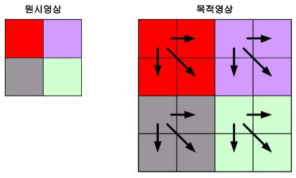

# 20190613 Day 7

##### [추가 자료] 영상처리참조용 / ch08_기하학적 변환.pdf

### 보간법 Interpolation

화소 값을 할당받지 못한 목적 영상의 품질은 좋지 못한데, 빈 화소에 값을 할당하여 좋은 품질의 영상을 만드는 방법

### 영상  축소 스케일링

```python
#Code07-02 컴퓨터비전 04.py
# 영상 확대 알고리즘
def zoomInImage() :
    global window, canvas, paper, filename, inImage, outImage, inH, inW, outH, outW

    scale = askinteger("축소", "배율을 입력해주세요", minvalue=2, maxvalue=4)

    ## [중요] 출력 영상 크기 결정 ##
    outH = inH * scale
    outW = inW * scale

    ## 메모리 할당 ##
    outImage = []
    outImage = malloc(outH, outW)

    ## 컴퓨터 비전 알고리즘 ##
    ## forward
    # for i in range(inH):
    #     for k in range(inW):
    #         outImage[i * scale][k * scale] = inImage[i][k]

    ## backward → 속도 개선
    for i in range(outH):
        for k in range(outW):
            outImage[i][k] = inImage[i // scale][k // scale]
    displayImage()

```


* 에일리어싱 Aliasing 

  영상의 크기를 많이 축소하려고 너무 낮은 비율로 샘플링을 수행하면 화소 수를 너무 적게 취하게 되어 영상의 세부 내용을 상실하게 되는 현상

  [안티에일리어싱](<http://www.itworld.co.kr/news/97807>)

  서브 샘플링 과정에서 세부 데이터를 잃어버리를 문제를 해결하려면 서브 샘플링을 수행하기 전에 먼저 영상의 블러링(Blurring)을 수행하면 된다

### 미디언 표현

화소 블록을 중간(Median)값으로 대치한 뒤 이 값을 샘플링하여 축소 영상의 화소로 사용

블러링 전처리로 서브 샘플링된 영상과는 다르게 화질이 선명


### 평균 표현

화소 블록을 블록 내 화소의 평균값으로 대치하는 방법

비교적 스무딩한 영상을 얻을 수 있다


```python
#Code07-02 컴퓨터비전 04.py
# 영상 축소 알고리즘 (평균변환)
def zoomOutImage2() :
    global window, canvas, paper, filename, inImage, outImage, inH, inW, outH, outW

    scale = askinteger("축소", "배율을 입력해주세요", minvalue=2, maxvalue=8)

    ## [중요] 출력 영상 크기 결정 ##
    outH = inH // scale
    outW = inW // scale

    ## 메모리 할당 ##
    outImage = []
    outImage = malloc(outH, outW)

    ## 컴퓨터 비전 알고리즘 ##
    for i in range(inH) :
        for k in range(inW) :
            outImage[i // scale][k // scale] += inImage[i][k]

    for i in range(outH) :
        for k in range(outW) :
            outImage[i][k] //= (scale * scale)
    displayImage()
```

---
### 영상  축소 스케일링

### 가장 인접한 이웃 화소 보간법

값을 할당받지 못한 목적 영상의 화소에서 가장 가깝게 이웃한 원시 화소의 값을 할당받은 목적 영상의 화소 값을 복사해서 사용

* 장점

  단순히 이웃 화소를 복사하여 사용하므로 처리 속도가 빠름

* 단점

  새로운 화소 값을 계산하지 않고 입력 화소 내에서만 찾기 때문에 원래의 영상과 전혀 다른 영상을 출력하는 오류 발생

  * 시각적인 뭉툭함 Blockniess

    하나의 입력 화소에 대응하는 출력 화소 수가 많아 영상의 질이 떨어지면서 생긴 영상 내 톱니 모양



```python
#Code07-02 컴퓨터비전 04.py
# 영상 확대 알고리즘
def zoomInImage() :
    global window, canvas, paper, filename, inImage, outImage, inH, inW, outH, outW

    scale = askinteger("축소", "배율을 입력해주세요", minvalue=2, maxvalue=4)

    ## [중요] 출력 영상 크기 결정 ##
    outH = inH * scale
    outW = inW * scale

    ## 메모리 할당 ##
    outImage = []
    outImage = malloc(outH, outW)

    ## 컴퓨터 비전 알고리즘 ##
    ## forward
    # for i in range(inH):
    #     for k in range(inW):
    #         outImage[i * scale][k * scale] = inImage[i][k]

    ## backward → 계산량을 줄여 속도 개선
    for i in range(outH):
        for k in range(outW):
            outImage[i][k] = inImage[i // scale][k // scale]
    displayImage()
```

### 선형 보간법 Linear Interpolation

원시 영상의 화소 값 두 개를 이용하여 원하는 좌표에서 새로운 화소 값을 계산하는 방법


### 양선형 보간 Bilinear Interpolation [참고](<https://darkpgmr.tistory.com/117>)

화소당 선형 보간을 세 번 수행하며, 새롭게 생성된 화소는 가장 가까운 화소 네 개에 가중치를 곱한 값을 합해서 얻는다

* 각 가중치는 각 화소에서의 거리에 정비례하도록 선형적으로 선택


```python
#Code07-02 컴퓨터비전 04.py
# 영상 확대 알고리즘 (양선형보간)
def zoomInImage2() :
    global window, canvas, paper, filename, inImage, outImage, inH, inW, outH, outW

    scale = askinteger("축소", "배율을 입력해주세요", minvalue=2, maxvalue=4)

    ## [중요] 출력 영상 크기 결정 ##
    outH = inH * scale
    outW = inW * scale

    ## 메모리 할당 ##
    outImage = []
    outImage = malloc(outH, outW)

    ## 컴퓨터 비전 알고리즘 ##
    rH, rW, iH, iW = [0] * 4 # 실수 위치 및 정수 위치
    x, y = 0, 0 # 실수와 정수의 차이값 = 가중치
    C1, C2, C3, C4 = [0] * 4 # 결정할 위치(N)의 상하좌우 픽셀
    for i in range(outH):
        for k in range(outW):
            rH = i / scale; rW = k / scale
            iH = int(rH);   iW = int(rW)
            x = rW - iW;    y = rH - iH
            if 0 <= iH < inH - 1 and 0 <= iW < inW - 1:
                C1 = inImage[iH][iW]
                C2 = inImage[iH][iW + 1]
                C3 = inImage[iH + 1][iW + 1]
                C4 = inImage[iH + 1][iW]
                newValue = C1 * (1 - y) * (1 - x) + C2 * (1 - y) * x + C3 * y * x + C4 * y * (1 - x)
                outImage[i][k] = int(newValue)

    displayImage()
```


---

##### [추가 자료] 영상처리참조용 / ch09_이동, 대칭, 회전, 워핑 기하학적 변환.pdf

### 회전


```python
#Code07-02 컴퓨터비전 04.py
# 영상 회전 알고리즘
def rotateImage(val = "") :
    global window, canvas, paper, filename, inImage, outImage, inH, inW, outH, outW
    ## [중요] 출력 영상 크기 결정 ##
    outH = inH
    outW = inW

    ## 메모리 할당 ##
    outImage = []
    outImage = malloc(outH, outW)

    ## 컴퓨터 비전 알고리즘 ##
    angle = askinteger("회전", "각도를 입력해주세요", minvalue = 1, maxvalue = 360)
    radian = angle * math.pi / 180
    for i in range(inH) :
        for k in range(inW) :
            xs = i
            ys = k
            xd = int(math.cos(radian) * xs - math.sin(radian) * ys)
            yd = int(math.sin(radian) * xs + math.cos(radian) * ys)

            if 0 <= xd < inH and 0 <= yd < inW :
                outImage[xd][yd] = inImage[i][k]
    displayImage()
```


* 개선점
  1. hole이 생김(크기가 더 커짐) - backward 방식 구현
  
     
  
  2. 기준점 변경 - 현재는 (0, 0) - 왼쪽 위가 기준
     
     * 영상의 중심이 (C~x~, C~y~)이고, 중심점을 기준으로 회전하는 forward 방향 공식
       $$
       \left[\begin{array}{rrr} x_{dest}\\y_{dest}\\ \end{array}\right] 
       = \left[\begin{array}{rrr} cos{\theta}&-sin{\theta}\\sin{\theta}&cos{\theta}\\ \end{array}\right] \left[\begin{array}{rrr} x_{source} - C_x\\y_{source} - C_y\\ \end{array}\right] + \left[\begin{array}{rrr} C_x\\C_y\\ \end{array}\right]
       $$
       
     
     * 더 효율적으로 회전하기 위한 backward 방향 공식
       $$
       \left[\begin{array}{rrr} x_{source}\\y_{source}\\ \end{array}\right] 
       = \left[\begin{array}{rrr} cos{\theta}&sin{\theta}\\-sin{\theta}&cos{\theta}\\ \end{array}\right] \left[\begin{array}{rrr} x_{dest} - C_x\\y_{dest} - C_y\\ \end{array}\right] + \left[\begin{array}{rrr} C_x\\C_y\\ \end{array}\right]
       $$
       

올바르게 회전하도록 하려면 화면 좌표를 수학적 좌표로 변환하여 회전한 뒤 다시 화면 좌표로 변환해야 한다

* forward 공식

$$
H_y = imageHeight - 1
$$

$$
x_{dest} =(x_{source} - C_x)*cos{\theta} - ((H_y - y_{source}) - C_y)*sin{\theta} + C_x
$$

$$
y_{dest} =(x_{source} - C_x)*sin{\theta} + (H_y - ((H_y -y_{source}) - C_y) * cos{\theta}) + C_y
$$

* backward 공식

$$
x_{source} =(x_{dest} - C_x)*cos{\theta} + ((H_y - y_{source}) - C_y)*sin{\theta} + C_x
$$

$$
y_{dest} = -(x_{dest} - C_x)*sin{\theta} + (H_y - ((H_y -y_{dest}) - C_y) * cos{\theta}) + C_y
$$


### 출력 영상의 크기를 고려한 회전 변환

입력 영상과 출력 영상의 크기를 같게 하면 출력 영상에서 잘려나가는 부분이 발생

회전의 기준을 원점에서 영상의 중심점으로 변경하면 이런 문제를 어느정도 해결할 수 있지만 그래도 잘려나가는 부분 발생

---

##### 파이썬 라이브러리를 활용한 데이터 분석 P.305

```python
#Code07-02 컴퓨터비전 04.py
# 히스토그램
import matplotlib.pyplot as plt
def histoImage() :
    global window, canvas, paper, filename, inImage, outImage, inH, inW, outH, outW
    countList = [0] * 256
    for i in range(outH) :
        for k in range(outW) :
            countList[inImage[i][k]] += 1
    plt.plot(countList)
    plt.show()
```


파란색 선 = LENNA512.raw / 노란색 선 = LENNA256.raw

이미지를 확대하는 과정에서 문제가 발생했음을 알 수 있다. 눈으로 보면 알 수 없음

* 영상 밝게하기 시 히스토그램 변화


* 영상 반전 시 히스토그램 변화


* 영상 확대 시 히스토그램 변화


---

##### [추가 자료] 영상처리참조용 / ch05_히스토그램을 이용한 화소 점 처리.pdf

* 이상적인 영상

  히스토그램 분포가 균일한 영상

### 앤드 - 인 탐색

일정한 양의 화소를 흰색이나 검정색으로 지정하여 히스토그램의 분포를 좀더 균일하게 만듦

히스토그램에서 양 끝을 잘라서(= min값에 더하고, max 값에서 빼준다) 영상 대비를 향상(화질 개선 X)

너무 많이 자르는 경우 영상의 형태가 무너짐

```python
#Code07-02 컴퓨터비전 04.py
def endInStretchImage() :
    global window, canvas, paper, filename, inImage, outImage, inH, inW, outH, outW
    ## [중요] 출력 영상 크기 결정 ##
    outH = inH
    outW = inW

    ## 메모리 할당 ##
    outImage = []
    outImage = malloc(outH, outW)

    ## 컴퓨터 비전 알고리즘 ##
    maxVal = inImage[0][0] # 유지되도 관계없는 값을 넣는다
    minVal = inImage[0][0]
    for i in range(inH) :
        for k in range(inW) :
            if inImage[i][k] < minVal :
                minVal = inImage[i][k]
            elif inImage[i][k] > maxVal :
                maxVal = inImage[i][k]

    minAdd = askinteger("최소", "최소 추가", minvalue = 0, maxvalue = 255)
    maxMinus = askinteger("최대", "최소 감소", minvalue=0, maxvalue=255)
    minVal += minAdd
    maxVal -= maxMinus

    for i in range(inH) :
        for k in range(inW) :
            value = int(((inImage[i][k] - minVal) / (maxVal - minVal)) * 255)
            if value < 0 :
                value = 0
            elif value > 255 :
                value = 255
            outImage[i][k] = value
    displayImage()
```


### 히스토그램 평활화 Histogram Equalized

어둡게 촬영된 영상의 히스토그램을 조절하여 명암 분포가 빈약한 영상을 균일하게 만들어줌

명암 대비 조정을 자동으로 수행

각 명암의 빈도를 변경하지 않음


#### 히스토그램 평활화의 3단계

1. 명암 값 j의 빈도 수 hist[j]를 계산해 입력 영상의 히스토그램 생성

2. 각 명암 값 i에서 0 ~ i 까지의 누적 빈도수(누적 합) 계산
   $$
   sum[i] = \sum_{j=0}^{i}hist[j]
   $$

3. 구한 누적 빈도수를 정규화 = 정규화 누적합
   $$
   n[i] = sum[i] * 1/N * I~max~
   $$

   $$
   N = 화소의 총 수, I_{max} = 최대 명도 값(보통, 255)
   $$

```python
#Code07-02 컴퓨터비전 04.py
# 히스토그램 평활화 알고리즘
def histoEqualizedImage() :
    global window, canvas, paper, filename, inImage, outImage, inH, inW, outH, outW
    ## [중요] 출력 영상 크기 결정 ##
    outH = inH
    outW = inW

    ## 메모리 할당 ##
    outImage = []
    outImage = malloc(outH, outW)

    ## 컴퓨터 비전 알고리즘 ##
    ## 1. 히스토그램 생성
    histo = [0] * 256;  sumHisto = [0] * 256;   normalHisto = [0] * 256
    for i in range(inH):
        for k in range(inW):
            histo[inImage[i][k]] += 1

    ## 2. 누적 빈도 수 계산
    sValue = 0
    for i in range(len(histo)) :
        sValue += histo[i]
        sumHisto[i] = sValue

    ## 3. 누적 빈도수 정규화
    normalHisto = list(map(lambda x : int(x / (inW * inH) * 255) , sumHisto))

    ## 영상처리
    for i in range(inH):
        for k in range(inW):
            outImage[i][k] = normalHisto[inImage[i][k]]

    displayImage()
```

---

##### [추가 자료] 영상처리참조용 / ch06_화소 영역 처리.pdf

#### 마스크 연산 시, 가장자리 처리

프로그래밍이 편하려면, 입력 영상보다 한 픽셀더 크게 선언하고 0으로 채워서 사용

---

### MISSION

1. [기하학 처리] 중 회전 추가

   1. 회전2 : 중심으로 회전, 역방향
   2. [선택] 회전 3 : 회전2 + 영상확대되기
   3. [선택] 회전 4 : 회전3 + 양선형 보간법

2. [화소영역 처리] 중 다음 추가

   1. 블러링
   2. 샤프닝
   3. 경계선 검출
   4. 가우시안 필터링
   5. 고주파
   6. 저주파
   7. 에지 검출 : 5개 이상
   8. [선택] LoG, DoG 에지 검출
   9. [선택] 다중 블러링 : 값을 입력받아 마스크의 크기를 가변적으로(3, 5, 7, 9, ...)

   