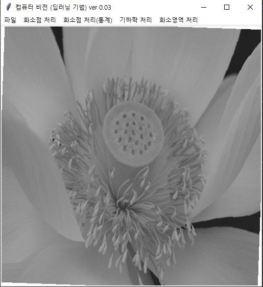
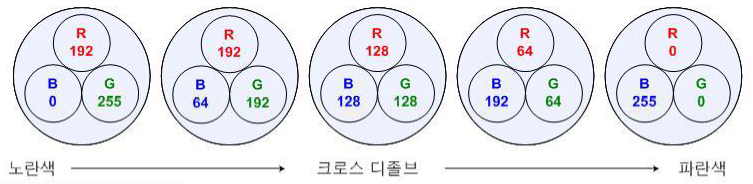
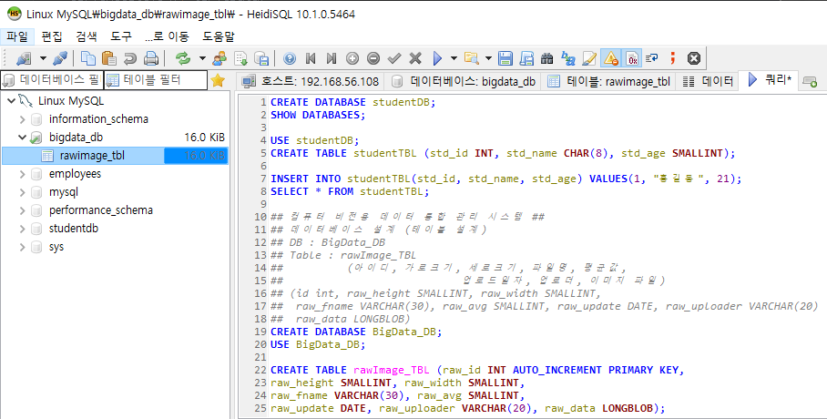
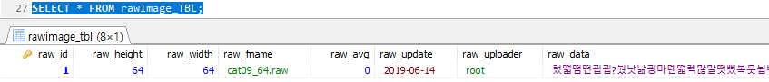
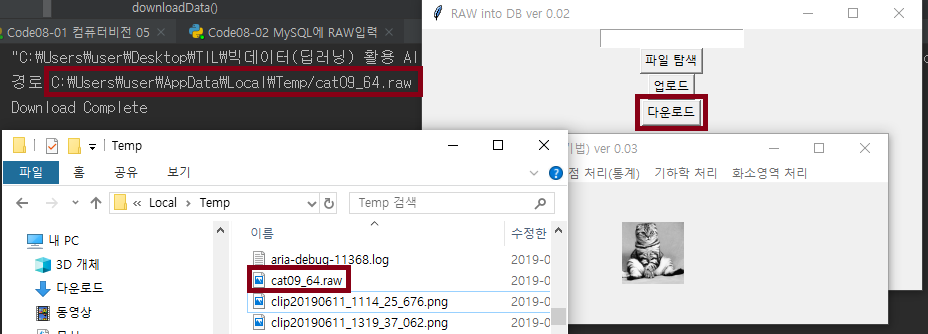

# 20190614

##### [추가 자료] 영상처리참조용 / ch09_이동, 대칭, 회전, 워핑 기하학적 변환.pdf

### 회전 - 중심 역방향

```python
#Code08-01 컴퓨터비전 05.py
# 영상 회전 알고리즘 - 중심, 역방향
def rotateImage2() :
    global window, canvas, paper, filename, inImage, outImage, inH, inW, outH, outW
    ## [중요] 출력 영상 크기 결정 ##
    outH = inH
    outW = inW

    ## 메모리 할당 ##
    outImage = []
    outImage = malloc(outH, outW)

    ## 컴퓨터 비전 알고리즘 ##
    angle = askinteger("회전", "각도를 입력해주세요", minvalue = 1, maxvalue = 360)
    radian = angle * math.pi / 180
    xc, yc = outW // 2, outH // 2
    for i in range(outH) :
        for k in range(outW) :
            xs = i
            ys = k

            # forward mapping → hole이 생김
            xd = int(xc + math.cos(radian) * (xs - xc) - math.sin(radian) * (ys - yc))
            yd = int(yc + math.sin(radian) * (xs - xc) + math.cos(radian) * (ys - yc))

            # backward mapping

            if 0 <= xd < outH and 0 <= yd < outW :
                outImage[xs][ys] = inImage[xd][yd]
            else :
                outImage[xs][ys] = 255
    displayImage()
```

* 2도 회전 시킨 경우

  영상의 가장자리가 매끄럽지 않은걸 볼 수 있다 → 양선형 보간 

  

### 모핑

한 영상을 서서히 변화시켜 다른 영상으로 변환하는 기술

최종 영상으로 매끄럽게 변할 수 있도록 많은 중단 단계의 영상이 필요하다

중간 단계의 영상을 생성하려면 **워핑**과 **합병** 단계를 거쳐야 한다

* 워핑

  두 영상의 중요한 특징을 좀더 가깝게 정렬하는 데 사용

  화소별로 이동 정도를 달리해 영상을 임의로 구부린 듯한 효과를 냄

* 합병

  영상이 순차적으로 자연스럽게 융합되도록 하는 크로스 디졸브 croww-dissolve로 처리됨

  

```python
#Code08-01 컴퓨터비전 05.py
# 모핑 알고리즘
def morphImage() :
    global window, canvas, paper, filename, inImage, outImage, inH, inW, outH, outW
    ## [중요] 출력 영상 크기 결정 ##
    outH = inH
    outW = inW
    ## 추가 영상 선택
    filename2 = askopenfilename(parent=window,
                               filetypes=(("RAW 파일", "*.raw;"), ("모든 파일", "*.*")))

    if filename2 == "" or filename2 == None :
        return
    fsize = os.path.getsize(filename2)
    inH2 = inW2 = int(math.sqrt(fsize))  

    inImage2 = malloc(inH2, inW2)

    with open(filename2, 'rb') as rFp:  
        for i in range(inH2):
            for k in range(inW2):
                inImage2[i][k] = int(ord(rFp.read(1)))

    ## 메모리 할당 ##
    outImage = []
    outImage = malloc(outH, outW)

    ## 컴퓨터 비전 알고리즘 ##
    w1 = askinteger("원영상 가중치", "가중치 값(%)을 입력해주세요", minvalue=0, maxvalue=100)
    w2 = 1 - (w1 / 100)
    w1 = 1 - w2
    for i in range(inH):
        for k in range(inW):
            newValue = int(inImage[i][k] * w1 + inImage2[i][k] * w2)
            if newValue > 255:  # overflow 처리
                newValue = 255
            if newValue < 0:  # underflow 처리
                newValue = 0
            outImage[i][k] = newValue
    displayImage()
    print("모핑 완료")
```


---

### MySQL로 RAW 파일 관리하기

* BLOB

  컴퓨터가 인식하는 모든 파일(이진 데이터)를 저장하는 타입. 최대 4GB

* 메타 데이터 meta data

  데이터의 정보를 알려주는 데이터

  데이터를 열람하지 않아도 어떤 데이터인지 짐작할 수 있게 만들어주는 데이터



```python
#Code08-02 MySQL에 RAW입력.py
import os.path
import pymysql
import datetime
def selectFile() :
    filename = askopenfilename(parent=window,
                               filetypes=(("RAW 파일", "*.raw;"), ("모든 파일", "*.*")))
    if filename == "" or filename == None :
        return
    edt1.insert(0, str(filename))

def uploadData() :
    con = pymysql.connect(host = IP_ADDR, user = USER_NAME, password = USER_PASS,
                          db = DB_NAME, charset = CHAR_SET)
    cur = con.cursor()

    fullname = edt1.get()
    with open(edt1.get(), "rb") as rfp :
        binData = rfp.read()

    fname = os.path.basename(fullname)
    fsize = os.path.getsize(fullname)
    height = width = int(math.sqrt(fsize))
    upDate = datetime.datetime.now().strftime("%y-%m-%d")
    upUser = USER_NAME

    sql = "INSERT INTO rawIMAGE_TBL(raw_id, raw_height, raw_width, raw_fname, raw_avg, " \
          "raw_update, raw_uploader, raw_data) " \
          "VALUES(NULL, " + str(height) + ", " + str(width) + ", '" + fname + "'," + str(0) + \
          ", '" + upDate + "', '" + upUser + "', %s )"
    print(sql)
    tupleData = (binData, )
    cur.execute(sql, tupleData)

    con.commit()
    cur.close()
    con.close()
    print("Upload Complete")
```



```python
#Code08-02 MySQL에 RAW입력.py
import tempfile
def downloadData() :
    con = pymysql.connect(host = IP_ADDR, user = USER_NAME, password = USER_PASS,
                          db = DB_NAME, charset = CHAR_SET)
    cur = con.cursor()
    sql = "SELECT raw_fname, raw_data FROM rawImage_TBL WHERE raw_id = 1"
    cur.execute(sql)
    fname, binData = cur.fetchone()

    fullpath = tempfile.gettempdir() + "/" + fname
    with open(fullpath, "wb") as wfp :
        wfp.write(binData)
    print("경로", fullpath)

    con.commit()
    cur.close()
    con.close()
    print("Download Complete")
```



---

### MISSION 

1. [컴퓨터 비전] 툴의 기능을 완성하기

   [선택1] : 대용량 파일의 경우, 일정 크기가 보이도록 하기 최대 512X512

   [선택]2 : 히스토그램 데이터 시각화 기능을 matplotlib 없이 구현하기

2. 이미지 데이터를  DB에 업로드 하는 프로그램 제작

   [선택1] : 특정 폴더를 선택하면 해당 폴더의 RAW 파일이 모두 업로드 되기

   [선택2] : RAW 파일의 평균, 최대값, 최소값도 계산되어 업로드

3. [컴퓨터 비전] 툴이 데이터베이스에서 처리되도록 하기 → 저장 결과도 DB에 저장 : 이런 경유 공유가 쉽다

---

* 압축기법

  00001111000111 → 04140313 → 0141114101311131 : 계속 압축을 한다고 해도 파일 크기가 계속 줄어드는 것은 아니다