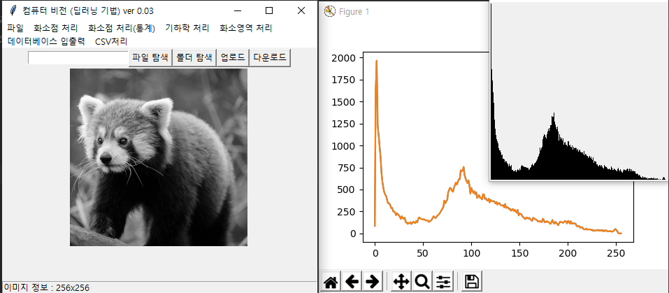

# 20190617

### 3 - 4 week

1. 데이터 시각화(컴퓨터 비전) + 데이터베이스 연계 완료 
   1. 이미지 데이터와 DB 저장/ 연동
   2. 대용량 이미지 데이터의 처리 기법
   3. 히스토그램 데이터 시각화
2. 파이썬 라이브러리를 활용한 데이터 분석/ 시각화
   1. CVS, JSON 데이터 분석/ 처리 → csv, josn (내부)
   2. 액셀 데이터분석/ 처리
   3. Numpy, Pandas, Matplotlib → 외부/ 라이브러리를 사용하는 이유? 
   4. 데이터 수집 → BeautifulSoup
3. 컬러 이미지 데이터 처리
   1. Pillow
4. 머신러닝/ 딥러닝 기반의 이미지 데이터 시각화/ 분석 → scikit-learn
   1. OpenCV, numpy, scipy, ...
   2. 머신러닝 : 하르케스케이드(기본으로 알고 있을 것, 활용빈도↑) → 얼굴인식, 코, 눈, 입, 고양이 ...
   3. 딥러닝 기반의 정지영상 사물 인식
   4. 딥러닝 기반의 동영상 사물 인식 + 컴퓨터 비전 알고리즘 적용

---

### Thread를 활용한 모핑 알고리즘 구현

```python
#Code09-01 컴퓨터비전 06.py
def morphImage() :
    global window, canvas, paper, filename, inImage, outImage, inH, inW, outH, outW
    ## 출력 영상 크기 결정 ##
    outH = inH
    outW = inW
    ## 추가 영상 선택
    filename2 = askopenfilename(parent=window,
                               filetypes=(("RAW 파일", "*.raw;"), ("모든 파일", "*.*")))

    if filename2 == "" or filename2 == None :
        return
    fsize = os.path.getsize(filename2)  
    inH2 = inW2 = int(math.sqrt(fsize))  

    ## 입력영상 메모리 확보 ##
    inImage2 = malloc(inH2, inW2)

    # 파일 → 메모리
    with open(filename2, 'rb') as rFp:  # 이진파일을 읽기 모드로 열기
        for i in range(inH2):
            for k in range(inW2):
                inImage2[i][k] = int(ord(rFp.read(1)))

    ## 메모리 할당 ##
    outImage = []
    outImage = malloc(outH, outW)

    ## 컴퓨터 비전 알고리즘 ##
    import threading
    import time
    def morpFunc():
        w1 = 1;
        w2 = 0
        for _ in range(20):
            for i in range(inH):
                for k in range(inW):
                    newValue = int(inImage[i][k] * w1 + inImage2[i][k] * w2)
                    if newValue > 255:
                        newValue = 255
                    elif newValue < 0:
                        newValue = 0
                    outImage[i][k] = newValue
            displayImage()
            w1 -= 0.05;
            w2 += 0.05
            time.sleep(0.5)

    threading.Thread(target=morpFunc).start()
    print("모핑 완료")

```

---

### 대용량 이미지 데이터의 처리 기법


```python
#Code09-01 컴퓨터비전 06.py
def displayImage() :
    global imageFrame, btnFrame, canvas, paper, filename, inImage, outImage, inH, inW, outH, outW
    global VIEW_X, VIEW_Y
    if canvas != None : 
        canvas.destroy()

    ## 고정된 화면 크기
    if inH <= VIEW_Y or inW <= VIEW_X :
        outW = inW
        outH = inH
        step = 1

        displayW = btnFrame.winfo_width() if outW < btnFrame.winfo_width() else outW
    else :
        outW = VIEW_X
        outH = VIEW_Y
        step = inW / VIEW_X # 정수로 떨어지지 않는 경우 처리를 위해 실수로 계산

        displayW = VIEW_X

    print("출력 크기", outH, outW)
    window.geometry(str(int(displayW * 1.2)) + 'x' + str(int(outW * 1.2)))
    canvas = Canvas(imageFrame, height=outH, width=outW)
    paper = PhotoImage(height=outH, width=outW)
    canvas.create_image((outH // 2, outW // 2), image=paper, state="normal")

    ## 영상 출력 성능 개선
    import numpy
    rgbStr = "" # 전체 픽셀의 문자열을 저장
    for i in numpy.arange(0, inH, step) : # numpy의 arange는 실수 step 사용 가능
        tmpStr = ""
        for k in numpy.arange(0, inW, step) :
            i = int(i); k = int(k)
            r = g = b = outImage[i][k]
            tmpStr += ' #%02x%02x%02x'  % (r, g, b) # [중요] 앞 한 칸 뛰기
        rgbStr += '{' + tmpStr + '} '# [중요] 뒤 한 칸 뛰기
    paper.put(rgbStr)

    ## 마우스 이벤트
    canvas.bind("<Button-1>", mouseClick)
    canvas.bind("<ButtonRelease-1>", mouseDrop)

    canvas.pack(expand = 1, anchor = CENTER)

    status.configure(text = "이미지 정보 : " + str(outW) + 'x' + str(outH))
```

---

### Subwindow를 이용해 matplotlib없이 히스토그램 데이터 시각화

```python
#Code09-01 컴퓨터비전 06.py
def histoImage2() :
    global window, canvas, paper, filename, inImage, outImage, inH, inW, outH, outW
    outCountList = [0] * 256
    normalCountList = [0] * 256

    # 빈도수 계산
    for i in range(inH) :
        for k in range(inW) :
            outCountList[inImage[i][k]] += 1

    maxVal = max(outCountList)
    minVal = min(outCountList)
    High = 256
    
    # 정규화 = (카운트값 - 최소값) * High / (최대값 - 최소값)
    for i in range(len(outCountList)) :
        normalCountList[i] = (outCountList[i] - minVal) * High / (maxVal - minVal)

    ## 서브 윈도우창 생성 후 출력
    subWindow = Toplevel(window) # window 창의 아래 level에 있다
    subWindow.geometry("256x256")
    subCanvas = Canvas(subWindow, width = 256, height = 256)
    subPaper = PhotoImage(width = 256, height = 256)
    subCanvas.create_image((256 // 2, 256//2), image = subPaper, state = "normal")

    for i in range(len(normalCountList)) :
        for k in range(int(normalCountList[i])) :
            data = 0
            subPaper.put("#%02x%02x%02x" % (data, data, data), (i, 255 - k)) # 회전 고려
    subCanvas.pack(expand = 1, anchor = CENTER)
    subWindow.mainloop()
```



---

### 일정한 패턴의 기능 단순화

```python
#Code09-01 컴퓨터비전 06.py
# 마스크를 활용한 알고리즘
def maskImage(mask, retouch = False) :
    global window, canvas, paper, filename, inImage, outImage, inH, inW, outH, outW
    ## 출력 영상 크기 결정 ##
    outH = inH
    outW = inW

    ## 메모리 할당 ##
    outImage = []
    outImage = malloc(outH, outW)

    ## 컴퓨터 비전 알고리즘 ##
    MSIZE = len(mask)

    ## 임시 입력 영상 메모리 확보
    tmpInImage = malloc(inH + MSIZE - 1, inW + MSIZE - 1, 127)  # 중간값을 넘겨주는 것이 좋다
    tmpOutImage = malloc(outH, outW)

    ## 원 입력 → 임시 입력
    for i in range(inH):
        for k in range(inW):
            tmpInImage[i + MSIZE // 2][k + MSIZE // 2] = inImage[i][k]

    ## 회선 연산
    for i in range(MSIZE // 2, inH + MSIZE // 2):
        for k in range(MSIZE // 2, inW + MSIZE // 2):
            # 각 점 처리
            S = 0.0
            for m in range(MSIZE):
                for n in range(MSIZE):
                    S += mask[m][n] * tmpInImage[i + m - MSIZE // 2][k + n - MSIZE // 2]
            tmpOutImage[i - MSIZE // 2][k - MSIZE // 2] = S

    if retouch == True :
        ## 127 더하기
        # 마스크의 합 = 0인 마스크 → 가중치 0, 일반적으로 어두워짐, 마스크의 합 = 1인 마스크 존재
        for i in range(outH):
            for k in range(outW):
                tmpOutImage[i][k] += 127

    ## 임시 출력 → 원 출력 영상
    for i in range(outH):
        for k in range(outW):
            value = tmpOutImage[i][k]
            if value > 255:
                value = 255
            elif value < 0:
                value = 0
            outImage[i][k] = int(value)

    displayImage()
    print("마스크 처리 완료")
```

```python
#Code09-01 컴퓨터비전 06.py
comvisionMenu4 = Menu(mainMenu)
    mainMenu.add_cascade(label="화소영역 처리", menu=comvisionMenu4)
    comvisionMenu4.add_command(label="엠보싱", command = lambda : maskImage(emboss, True))
    comvisionMenu4.add_command(label="블러링", command = lambda : maskImage(blurr))
    comvisionMenu4.add_command(label="샤프닝", command = lambda : maskImage(sharpening))
    comvisionMenu4.add_command(label="가우시안 필터링", command = lambda : maskImage(gaussian))
    comvisionMenu4.add_command(label="고주파", command = lambda : maskImage(hpf, True))
    comvisionMenu4.add_command(label="저주파", command = lambda : maskImage(lpf))
```

---

### 폴더 내의 데이터 DB에 저장

```python
#Code09-02 MySQL에 RAW입력(폴더).py
def selectFile() :
    global rawFileList
    filename = askopenfilename(parent=window,
                               filetypes=(("RAW 파일", "*.raw;"), ("모든 파일", "*.*")))
    if filename == "" or filename == None :
        return

    rawFileList = []
    dirName, extname = filename.split(".")
    if extname.upper().strip() == "RAW":  # [중요] 공백처리
        rawFileList.append(dirName + "." + extname)
    edt1.insert(0, str(filename))

def selectFolder() :
    global rawFileList
    foldername = askdirectory()
    if foldername == "" or foldername == None:
        return
    edt1.insert(0, str(foldername))

    # 파일 목록 읽기
    rawFileList = []
    for dirName, subDirList, fnames in os.walk(foldername) :
        for fname in fnames :
            filename, extname = os.path.basename(fname).split(".")
            if extname.upper().strip() == "RAW" : # [중요] 공백처리
                rawFileList.append(os.path.join(dirName, fname))
    print(rawFileList)

def findStat(fname) :
    fsize = os.path.getsize(fname)
    inH = inW = int(math.sqrt(fsize))

    inImage = malloc(inH, inW)

    # 파일 → 메모리
    with open(fname, 'rb') as rFp:
        for i in range(inH):
            for k in range(inW):
                inImage[i][k] = int(ord(rFp.read(1)))

    sum = 0
    for i in range(inH) :
        for k in range(inW) :
            sum += inImage[i][k]
    avg = sum // (inH * inW)

    maxVal = inImage[0][0]
    minVal = inImage[0][0]
    for i in range(inH):
        for k in range(inW):
            if inImage[i][k] < minVal:
                minVal = inImage[i][k]
            elif inImage[i][k] > maxVal:
                maxVal = inImage[i][k]

    return avg, maxVal, minVal

def uploadData() :
    global rawFileList
    con = pymysql.connect(host = IP_ADDR, user = USER_NAME, password = USER_PASS,
                          db = DB_NAME, charset = CHAR_SET)
    cur = con.cursor()

    try :
        sql = '''
            CREATE TABLE rawImage_TBL (
            raw_id INT AUTO_INCREMENT PRIMARY KEY,
            raw_fname VARCHAR(30),
            raw_extname CHAR(5),
            raw_height SMALLINT, raw_width SMALLINT,
            raw_avg TINYINT UNSIGNED, 
            raw_max TINYINT UNSIGNED,
            raw_min TINYINT UNSIGNED)
        '''
        cur.execute()
    except : # 이미 TABLE이 존재하는 경우
        pass

    for fullname in rawFileList:
        with open(fullname, 'rb') as rfp:
            binData = rfp.read()

        fname, extname = os.path.basename(fullname).split(".")
        fsize = os.path.getsize(fullname)
        height = width = int(math.sqrt(fsize))

        avgVal, maxVal, minVal = findStat(fullname) # 평균, 최대, 최소
        print(avgVal, maxVal, minVal)

        sql = "INSERT INTO rawImage_TBL(raw_id, raw_fname, raw_extname, raw_height, raw_width, "
        sql += "raw_avg, raw_max, raw_min, raw_data) "
        sql += "VALUES(NULL, '" + fname + "', '" + extname + "', " + str(height) + ", " + str(width) + ", "
        sql += str(avgVal) + ", " + str(maxVal) + ", " + str(minVal) + " , %s )"
        print(sql)
        tupleData = (binData, )
        cur.execute(sql, tupleData)

    con.commit()
    cur.close()
    con.close()
    print("Upload Complete")
```


---

### Quiz

1. SQLite에 저장하기/ 불러오기 추가

   * **AUTOINCREMENT** 옵션을 사용할 때 주의할 점 [[참고]](<https://stackoverflow.com/questions/26652393/how-to-correctly-set-auto-increment-fo-a-column-in-sqlite-using-python>)

   * 저장하기 [[참고]5. DML]([http://pythonstudy.xyz/python/article/204-SQLite-%EC%82%AC%EC%9A%A9](http://pythonstudy.xyz/python/article/204-SQLite-사용))

```python
#Code09-03 quiz-01.py
####################
## SQLite DB 연동 ##
####################
def loadSqlite() :
    conn = sqlite3.connect("bigData_DB")  # 1. DB 연결
    cur = conn.cursor()
    sql = "SELECT raw_id, raw_fname, raw_extname, raw_height, raw_width "
    sql += "FROM rawImage_TBL"
    cur.execute(sql)

    sql = "SELECT raw_id, raw_fname, raw_extname, raw_height, raw_width "
    sql += "FROM rawImage_TBL"
    cur.execute(sql)

    queryList = cur.fetchall()
    rowList = [':'.join(map(str, row)) for row in queryList]

    def selectRecord():
        global window, canvas, paper, filename, inImage, outImage, inH, inW, outH, outW
        selIndex = listbox.curselection()[0]  # 선택한 것 중 첫번째
        subWindow.destroy()
        raw_id = queryList[selIndex][0]

        sql = "SELECT raw_fname, raw_extname, raw_data FROM rawImage_TBL "
        sql += "WHERE raw_id = " + str(raw_id)

        cur.execute(sql)
        fname, extname, binData = cur.fetchone()

        fullpath = tempfile.gettempdir() + "/" + fname + "." + extname
        with open(fullpath, "wb") as wfp:
            wfp.write(binData)
        print("경로", fullpath, "에 저장")

        loadImage(fullpath)
        equalImage()

    ### 서브 윈도우창에 목록 출력하기
    subWindow = Toplevel(window)  # window 창의 아래 level에 있다
    listbox = Listbox(subWindow)
    btn = Button(subWindow, text="선택", command=selectRecord)

    for rowStr in rowList:
        listbox.insert(END, rowStr)

    listbox.pack(expand=1, anchor=CENTER)
    btn.pack()
    subWindow.mainloop()

    cur.close()
    conn.close()
    print("Load data from SQLite OK")

def saveSqlite() :
    conn = sqlite3.connect("bigData_DB")
    cur = conn.cursor()
    sql = "CREATE TABLE IF NOT EXISTS rawImage_TBL ( "
    sql += "raw_id INTEGER PRIMARY KEY AUTOINCREMENT, raw_fname VARCHAR(30), raw_extname CHAR(5), "
    sql += "raw_height SMALLINT, raw_width SMALLINT, "
    sql += "raw_avg TINYINT UNSIGNED, raw_max TINYINT UNSIGNED, raw_min TINYINT UNSIGNED, "
    sql += "raw_data LONGBLOB);" # AUTOINCREMENT를 사용하는 경우 값을 넣어주지 않는다
    cur.execute(sql)

    fullname = saveTempImage()
    fullname = fullname.name
    with open(fullname, 'rb') as rfp:
        binData = rfp.read()

    fname, extname = os.path.basename(fullname).split(".")
    fsize = os.path.getsize(fullname)
    height = width = int(math.sqrt(fsize))

    avgVal, maxVal, minVal = findStat(fullname)  # 평균, 최대, 최소

    sql = "INSERT INTO rawImage_TBL(raw_fname, raw_extname, raw_height, raw_width, "
    sql += "raw_avg, raw_max, raw_min, raw_data) "
    sql += "VALUES('" + fname + "', '" + extname + "', " + str(height) + ", " + str(width) + ", "
    sql += str(avgVal) + ", " + str(maxVal) + ", " + str(minVal) + ", ? )" # formatting에 ?를 사용

    tupleData = (binData,)
    cur.execute(sql, tupleData)

    conn.commit()
    cur.close()
    conn.close()
    print("SQLite SAVE OK")
```


---

### Quiz 

1. 선택된 CSV를 TreeView로 출력하기

```python
#Code09-07 quiz-02.py
import csv
from tkinter.filedialog import *
from tkinter import *
from tkinter import ttk

if __name__ == '__main__':
    filename = askopenfilename(parent = None, filetypes=(("CSV 파일", "*.csv;"), ("모든 파일", "*.*")))

    csvList = []
    with open(filename) as rfp :
        reader = csv.reader(rfp)
        headerList = next(reader)

        for clist in reader :
            csvList.append(clist)

    window = Tk()
    window.geometry("800x500")

    sheet = ttk.Treeview(window)

    # 첫번째 열 만들기
    sheet.column('#0', width=60)  # 첫 컬럼의 내부 이름
    sheet.heading('#0', text="INDEX")

    # 두번째 이후 열 만들기
    sheet["columns"] = tuple(headerList)  # 두번째 이후 컬럼의 내부이름(내맘대로)
    for i in range(len(sheet["columns"])):
        sheet.column(sheet["columns"][i], width=100);
        sheet.heading(sheet["columns"][i], text=sheet["columns"][i])

    # 내용 채우기
    index = 1
    for i in range(len(csvList)) :
        tmp = []
        for val in csvList[i] :
            tmp.append(val)
        sheet.insert('', 'end', text=str(index), values=tuple(tmp))
        index += 1

    sheet.pack()
    window.mainloop()
```


[[참고] treeview scrollbar](<https://stackoverflow.com/questions/42996627/horizontal-scrollbar-treeview-in-tkinter?noredirect=1&lq=1>)

---

### MISSION

1. [컴퓨터비전]에서 [CSV처리] → [CSV 저장] 메뉴를 선택해서, 다음 형식으로 저장한다
2. [CSV처리] → [CSV 열기] 메뉴를 선택해서 위에서 저장한 CSV를 화면에 출력(영상으로 출력)

```python
#Code09-08 mission.py
###################
## CSV 관련 함수 ##
###################
def saveToCsv():
    global window, canvas, paper, filename, inImage, outImage, inH, inW, outH, outW
    if inImage == [] :
        messagebox.showinfo("Error", "선택된 이미지가 없습니다")
        return
 
    ## 저장할 경로와 파일이름 지정
    saveFp = asksaveasfile(parent=None, mode="wt", defaultextension="*.csv",
                           filetypes=(("CSV 파일", "*.csv;"), ("모든 파일", "*.*")))
 
    with open(saveFp.name, mode="w", newline="") as wFp:
        writer = csv.writer(wFp)
 
        for i in range(inH) :
            for k in range(inW) :
                writer.writerow([i, k, inImage[i][k]])
 
 
def loadFromCsv():
    global window, canvas, paper, filename, inImage, outImage, inH, inW, outH, outW
    filename = askopenfilename(parent=None, filetypes=(("CSV 파일", "*.csv;"), ("모든 파일", "*.*")))
 
    if filename == None or filename == "" :
        messagebox.showinfo("Error", "파일이름을 입력하지 않았습니다")
        return
 
    csvList = []
    with open(filename) as rfp:
        reader = csv.reader(rfp)
 
        for clist in reader:
            csvList.append(clist)
 
 
    # 입력영상은 정방형이라고 가정
    inH = inW = int(math.sqrt(len(csvList)))
 
    ## 메모리 할당 ##
    inImage = []
    inImage = malloc(inH, inW)
 
    idx = 0
    for i in range(inH) :
        for k in range(inW) :
            inImage[i][k] = int(csvList[idx][2]) # csv data를 불러오면 str형태이므로 int로 치환
            idx +=1
    equalImage()

```

