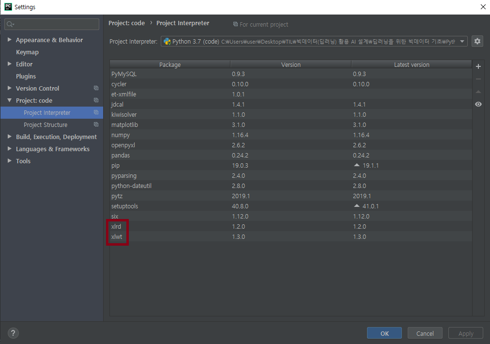
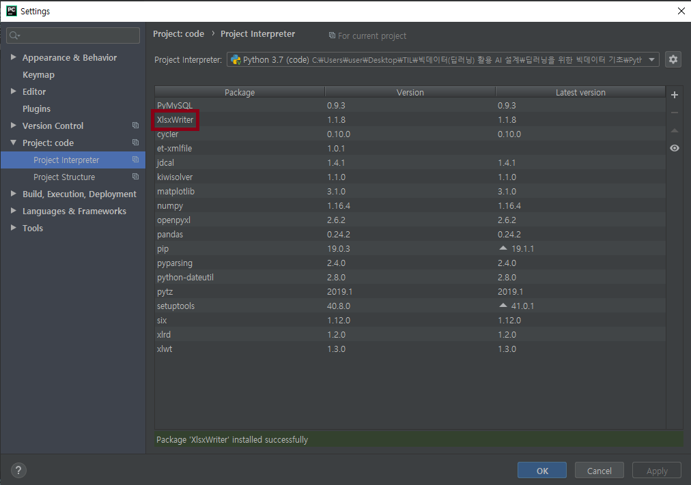
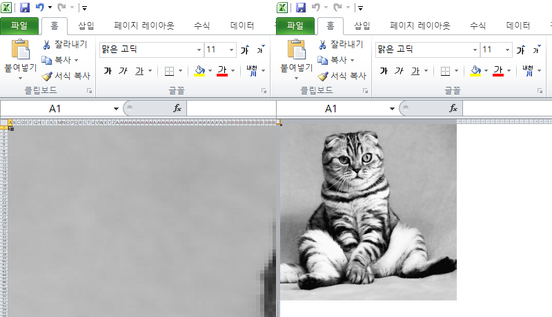
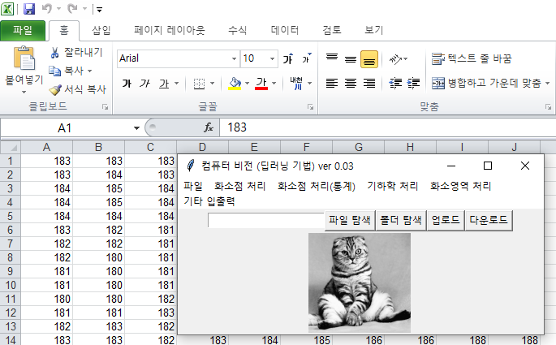
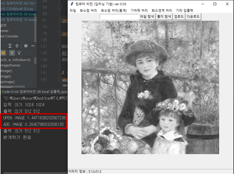
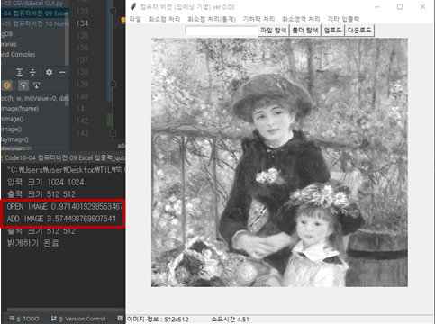
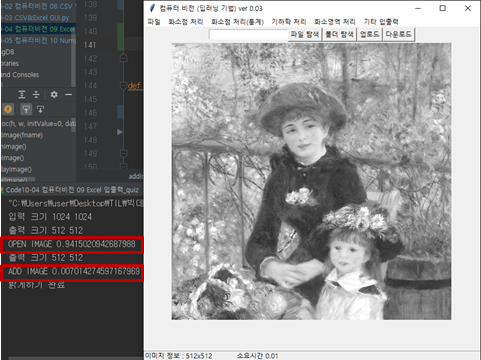

# 20190618

### 엑셀 데이터 분석

### 선택된 CSV 데이터를 TreeView로 출력

```python
#Code10-01 CSV 04 GUI.py
from tkinter import ttk
import csv
from tkinter.filedialog import *

def openCSV() :
    global csvList
    # 파일 선택
    filename = askopenfilename(parent=None, filetypes=(("CSV 파일", "*.csv;"), ("모든 파일", "*.*")))

    # 데이터 csvList에 읽어오기
    csvList = []
    with open(filename) as rfp:
        reader = csv.reader(rfp)
        headerList = next(reader)

        for clist in reader:
            csvList.append(clist)
        print(csvList)

    # 기존 시트 클리어 - 하위 포함
    sheet.delete(*sheet.get_children())

    # 첫번째 열 헤더 만들기
    sheet.column('#0', width=70)  # 첫 컬럼의 내부 이름
    sheet.heading('#0', text=headerList[0])

    # 두번째 이후 열 만들기
    sheet["columns"] = headerList[1:]
    for colName in headerList[1:] :
        sheet.column(colName, width = 70) # 내부이름
        sheet.heading(colName, text=colName) # 실제 이름

    # 내용 채우기
    for row in csvList :
        sheet.insert("", "end", text=row[0], values=row[1:])
    sheet.pack(expand = 1, anchor = CENTER)

#####################
## 전역변수 선언부 ##
#####################
csvList = [] # 불러온 CSV 데이터를 저장하는 list


if __name__ == '__main__':
    window = Tk()
    window.geometry("600x500")

    # 메뉴 생성
    mainMenu = Menu(window)
    window.config(menu=mainMenu)

    fileMenu = Menu(mainMenu)
    mainMenu.add_cascade(label="CSV 처리", menu=fileMenu)
    fileMenu.add_cascade(label="CSV 열기", command=openCSV)

    # treeview 생성
    sheet = ttk.Treeview(window)
    window.mainloop()
```

---

### 선택된 Excel 데이터를 TreeView로 출력



```python
#Code10-03 CSV&Excel GUI.py
from tkinter import ttk
from tkinter.filedialog import *
import xlrd
def openExcel() :
    global csvList
    # 파일 선택
    filename = askopenfilename(parent=None, filetypes=(("엑셀 파일", "*.xls;*.xlsx"), ("모든 파일", "*.*")))

    # 데이터 csvList에 읽어오기
    csvList = []
    workbook = xlrd.open_workbook(filename) # 엑셀 파일 자체 = work book, 각 시트 = work sheet
    print(workbook.nsheets)

    wsList = workbook.sheets()
    headerList = []
    for i in range(wsList[0].ncols) :
        headerList.append(wsList[0].cell_value(0, i))
    print(headerList)

    for worksheet in workbook.sheets() :
        print(worksheet.name, worksheet.nrows, worksheet.ncols)

    # 내용 채우기
    for wsheet in wsList :
        rowCount = wsheet.nrows
        colCount = wsheet.ncols
        for i in range(1, rowCount) :
            tmpList = []
            for k in range(0, colCount) :
                tmpList.append(wsheet.cell_value(i, k))
            csvList.append(tmpList)

    # 기존 시트 클리어 - 하위 포함
    sheet.delete(*sheet.get_children())

    # 첫번째 열 헤더 만들기
    sheet.column('#0', width=70)  # 첫 컬럼의 내부 이름
    sheet.heading('#0', text=headerList[0])

    # 두번째 이후 열 만들기
    sheet["columns"] = headerList[1:]
    for colName in headerList[1:] :
        sheet.column(colName, width = 70) # 내부이름
        sheet.heading(colName, text=colName) # 실제 이름

    # 내용 채우기
    for row in csvList :
        sheet.insert("", "end", text=row[0], values=row[1:])
    sheet.pack(expand = 1, anchor = CENTER)

```

---

### 데이터를 Excel 파일로 저장

```python
import xlwt
def saveExcel():
    global window, canvas, paper, filename, inImage, outImage, inH, inW, outH, outW
    saveFp = asksaveasfile(parent=window, mode="wb",
                           defaultextension="*.xls",
                           filetypes=(("XLS 파일", "*.xls;"), ("모든 파일", "*.*")))
    if saveFp == "" or saveFp == None:
        return

    xlsName = saveFp.name
    sheetName = os.path.basename(filename)# sheet하나에 데이터가 들어있다고 가정

    wb = xlwt.Workbook() # 파일 자체 준비
    ws = wb.add_sheet(sheetName) #  filename으로 sheet 생성
    for i in range(outH) :
        for k in range(outW) :
            ws.write(i, k, outImage[i][k])
    wb.save(xlsName) # xlsName으로 파일 저장
    print("Excel save OK")
```

---

### Excel에 셀의 배경색을 지정하여 이미지 출력해보기



```python
#Code10-04 컴퓨터비전 09 Excel 입출력_quiz.py
import xlsxwriter
def saveExcelArt():
    global window, canvas, paper, filename, inImage, outImage, inH, inW, outH, outW
    saveFp = asksaveasfile(parent=window, mode="wb",
                           defaultextension="*.xls",
                           filetypes=(("XLS 파일", "*.xls;"), ("모든 파일", "*.*")))
    if saveFp == "" or saveFp == None:
        return

    xlsName = saveFp.name
    sheetName = os.path.basename(filename)# sheet하나에 데이터가 들어있다고 가정

    wb = xlsxwriter.Workbook(xlsName) # xlsName의 파일 자체 준비
    ws = wb.add_worksheet(sheetName) # sheet 생성

    ws.set_column(0, outW -1, 1.0) # 0부터 outW-1까지 약 0.34
    for i in range(outH) :
        ws.set_row(i, 9.5) # i번재 행을 약 0.35

    for i in range(outH) :
        for k in range(outW) :
            data = outImage[i][k]
            # data 값으로 셀의 배경색을 조절 #000000 ~ #FFFFFF
            if data > 15 :
                hexStr = "#" + hex(data)[2:] * 3 # ox를 떼고 RGB값을 같은 값으로 넣어준다
            else :
                hexStr = "#" + ("0" + hex(data)[2:]) * 3

            # 셀의 포맷 준비
            cell_format = wb.add_format()
            cell_format.set_bg_color(hexStr)

            ws.write(i, k, "", cell_format) # ""자리를 실제 들어가는 값
    wb.close() # 파일 저장
    print("Excel save OK")
```



---

### Quiz

1. 숫자로 저장한 excel 데이터를 읽어서 영상으로 출력하기

```python
#Code10-04 컴퓨터비전 09 Excel 입출력_quiz.py
import xlrd
def openExcel() :
    global window, canvas, paper, filename, inImage, outImage, inH, inW, outH, outW
    filename = askopenfilename(parent=None, filetypes=(("엑셀 파일", "*.xls;*.xlsx"),
                                                       ("모든 파일", "*.*")))
    if filename == "" or filename == None:
        return

    # 헤더는 존재하지 않는다고 가정
    # sheet는 1개라고 가정
    workbook = xlrd.open_workbook(filename)
    ws = workbook.sheets()[0]
    print("LOAD Sheet",ws.name)

    inH, inW = ws.nrows, ws.ncols
    inImage = malloc(inH, inW)

    for i in range(inH) :
        for k in range(inW) :
            inImage[i][k] = int(ws.cell_value(i, k))
    equalImage()
```



---

##### 파이썬 라이브러리를 활용한 데이터 분석 p.115

### Numpy 기본

* NumPy에서 제공하는 기능 = Numpy를 써야되는 이유
  1. **빠르고 메모리를 효율적으로 사용**하면 벡터 **산술연산**과 브로드캐스팅 기능을 제공하는 다차원 배열인 **ndarray** 제공
  2. **반복문을 작성할 필요없이** 전체 데이터 배열에 대해 빠른 연산을 제공하는 표준 수학 함수
  3. 배열 데이터를 디스크에 쓰거나 읽을 수 있는 도구와 메모리에 올려진 파일을 사용하는 도구
  4. 선형대수, 난수 발생기, 푸리에 변환 기능
  5. C, C++, 포트란으로 쓰여진 코드를 통합하는 도구

* **한계** 

  **동일한 데이터 타입**을 가져야한다

* **Vector** 

  1차원 list ndarray

* **Matrix** 

  2차원 이상 list ndarray

* **dtype**

  특정 데이터의 자료형을 명시하여 메모리 낭비를 방지할 수 있다

  * arr.**astype**(np.type) - dtype을 다른 형으로 명시적 변경

```python
>>> import numpy as np
>>> data = np.random.randn(2, 3) # 평균0, 표준편차 1의 가우시안 표준정규분포 난수를 matrix array(m, n)으로 생성
>>> data
array([[ 1.34478463, -0.49998088, -2.13628667],
       [-0.25998344, -0.09733514, -0.47425905]])
>>> import random
>>> dataList = [[random.random() for _ in range(3)] for _ in range(2)]
>>> dataList
[[0.44575912481908475, 0.7154670263166054, 0.898610173760461], [0.08291977461054534, 0.38507854755986426, 0.6796717575039685]]

>>> data[0] # 0행
array([ 1.34478463, -0.49998088, -2.13628667])
>>> dataList[0] # 0번째 요소
[0.44575912481908475, 0.7154670263166054, 0.898610173760461]
>>> data[0][1] # 0행 1열
-0.49998088278702196
>>> dataList[0][1] # 0번째 요소의 1번째 요소
0.7154670263166054
>>> data[0, 1]# [row, col]로 접근 가능
-0.49998088278702196
>>> dataList[0, 1]
Traceback (most recent call last):
  File "<input>", line 1, in <module>
TypeError: list indices must be integers or slices, not tuple

>>> A = [[10, 20], [30, 40]]
>>> B = [[1, 2], [3, 4]]
>>> A + B # list의 덧셈 연산은 list를 합치는 기능을 한다
[[10, 20], [30, 40], [1, 2], [3, 4]]
>>> AA = np.array(A)
>>> BB = np.array(B)
>>> AA
array([[10, 20],
       [30, 40]])
>>> BB
array([[1, 2],
       [3, 4]])
>>> AA + BB # matrix의 덧셈 연산은 각 동일한 위치의 요소 간 덧셈연산이다
array([[11, 22],
       [33, 44]])
>>> A * 2 # list의 곱셈 연산은 list를 반복하여 붙이는 것과 같다
[[10, 20], [30, 40], [10, 20], [30, 40]]
>>> AA * 2 # 브로드캐스팅 연산 → 2를 [[2, 2], [2, 2]] 로 변형하여 각 동일한 위치의 요소와 곱셈 연산
array([[20, 40],
       [60, 80]])

>>> AA.shape # array의 크기
(2, 2)
>>> AA.dtype # 데이터 타입
dtype('int32')

>>> V1 = np.array([1, 2, 3]) # list → array
>>> V2 = np.array([4, 5, 6])
>>> V1.shape
(3,)
>>> AA.ndim # 차원
2

>>> V1 + V2
array([5, 7, 9])
>>> V1 * V2
array([ 4, 10, 18])

>>> data
array([[ 1.34478463, -0.49998088, -2.13628667],
       [-0.25998344, -0.09733514, -0.47425905]])
>>> data.shape
(2, 3)
>>> data.reshape(3, 2) # 값 변화X, 값만 재배열하여 결과값 return 다른 연산 필요 시, 저장 필요
array([[ 1.34478463, -0.49998088],
       [-2.13628667, -0.25998344],
       [-0.09733514, -0.47425905]])

>>> AA*BB # 각 요소를 곱함
array([[ 10,  40],
       [ 90, 160]])
>>> CC = np.dot(AA, BB) # 행렬 곱셈 연산 → 앞 행렬의 가로와 뒤 행렬의 세로의 길이가 일치해야한다
>>> CC
array([[ 70, 100],
       [150, 220]])

>>> CC + 1
array([[ 71, 101],
       [151, 221]])
>>> CC + np.array([33, 44]) # → [[33, 44], [33, 44]]
array([[103, 144],
       [183, 264]])

>>> data.T # 전치행렬
array([[ 1.34478463, -0.25998344],
       [-0.49998088, -0.09733514],
       [-2.13628667, -0.47425905]])

>>> list1 = [n for n in range(10, 70, 10)]
>>> list1
[10, 20, 30, 40, 50, 60]
>>> AA = np.array(list1)
>>> AA
array([10, 20, 30, 40, 50, 60])
>>> BB = AA.reshape(3, 2)
>>> BB
array([[10, 20],
       [30, 40],
       [50, 60]])
>>> BB[:, 0] # 전체 행의 0열
array([10, 30, 50])
>>> BB[0:-1, 1:2] # -1 = 마지막 행 0:-1 → 0행부터 마지막행 전까지, 1열
array([[20],
       [40]])
>>> BB[:, :] # 복사 시 사용
array([[10, 20],
       [30, 40],
       [50, 60]])
>>> BB = CC # 동일한 메모리를 공유하게됨
>>> CC[0, 0] = 1111
>>> CC
array([[1111,  100],
       [ 150,  220]])
>>> BB
array([[1111,  100],
       [ 150,  220]])
>>> CC = BB[:, :]
>>> list2 = [n for n in range(10, 90, 10)]
>>> list2
[10, 20, 30, 40, 50, 60, 70, 80]
>>> AA = np.array(list2)
>>> AA = np.array(list2).reshape(2, 4)
>>> AA
array([[10, 20, 30, 40],
       [50, 60, 70, 80]])
>>> it = np.nditer(AA, flags = ["multi_index"], op_flags = ["readwrite"]) # 별로 빠르지 않다. 이게 최선인가? 생각해볼 것
>>> while not it.finished :
    	idx = it.multi_index
    	print(AA[idx])
    	it.iternext()
10
20
30
40
50
60
70
80
```


````python
>>> BB = BB.reshape(1, 4)
>>> BB
array([[1111,  100,  150,  220]])
>>> CC = np.concatenate((AA, BB), axis = 0) # axis = 0 : row
>>> CC
array([[  10,   20,   30,   40],
       [  50,   60,   70,   80],
       [1111,  100,  150,  220]])
>>> DD = np.array([100, 200, 300])
>>> DD.shape
(3,)
>>> DD = DD.reshape(3, 1)
>>> DD
array([[100],
       [200],
       [300]])
>>> CC = np.concatenate((CC, DD), axis = 1) # axis = 1 : col
>>> CC
array([[  10,   20,   30,   40,  100],
       [  50,   60,   70,   80,  200],
       [1111,  100,  150,  220,  300]])

>>> data = np.loadtxt(".\\images\\csv\\cat.csv", delimiter = ",", dtype = np.int32) # 해당 경로의 데이터를 읽어오는데 ,으로 split하고 데이터 타입을 int32로 정한다
>>> rows = data[:, 0:1]
>>> rows[0:5]
array([[0],
       [0],
       [0],
       [0],
       [0]])
>>> np.max(rows)
127
>>> np.min(rows)
0

>>> np.zeros([2, 3]) # 초기화시 유용
array([[0., 0., 0.],
       [0., 0., 0.]])
>>> np.zeros([2, 3], dtype = "uint8")
array([[0, 0, 0],
       [0, 0, 0]], dtype=uint8)
>>> np.ones([2, 3], dtype = "uint8")
array([[1, 1, 1],
       [1, 1, 1]], dtype=uint8)
````

---

### Quiz 

1. List와 Numpy의 영상 밝게 하기 성능 비교
   * List → 2중 for문
   * Numpy → 형변환 → iterator

```python
#Code10-04 컴퓨터비전 09 Excel 입출력_quiz.py
def addImage() :
    global window, canvas, paper, filename, inImage, outImage, inH, inW, outH, outW
    outH = inH; outW = inW

    value = askinteger("밝게/어둡게 하기", "값을 입력해주세요", minvalue = -255, maxvalue = 255)
    inImage = inImage.astype(np.int16)
    outImage = inImage + value

    start = time.time()
    outImage = np.where(outImage > 255, 255, outImage)
    outImage = np.where(outImage < 0, 0, outImage)
    # iter = np.nditer(outImage, flags=["multi_index"], op_flags=["readwrite"])
    # while not iter.finished :
    #     idx = iter.multi_index
    #     if outImage[idx] > 255 :
    #         outImage[idx] = 255
    #     elif outImage[idx] < 0 :
    #         outImage[idx] = 0
    #     iter.iternext()
    seconds = time.time() - start
    displayImage()
    status.configure(text = status.cget("text") + "\t소요시간 {0:.2f}".format(seconds))
    print("ADD IMAGE", seconds)
    print("밝게하기 완료")
```







* iterator를 쓰는 것이 항상 빠를까?

  첫번째 사진은 이중 for문을 사용하여 inImage에 특정값을 더하고 overflow와 unflow를 고려하여 outImage를 출력하는데 걸린 시간이고, 두번째 사진은 numpy의 배열의 산술연산 브로드캐스팅을 이용하여 특정값을 더하고 iterator를 사용하여 overflowdhk unflow를 고려한 outImage를 출력한 결과값이다. 세번째 사진은 numpy의 배열의 산술연산 브로드캐스팅을 이용하여 특정값을 더하고 numpy.where 함수를 사용해 overflow와 underflow를 고려한 결과값이다.

  

  출력된 시간을 보면 세번째, 첫번째, 두번째 순서대로 빠른걸 알 수 있다. iterator를 사용하는 것이 빠른 것이 아니며 상황에 따라 알맞은 구현을 해야한다.

---

### MISSION

1. [컴퓨터비전] Numpy로 구현