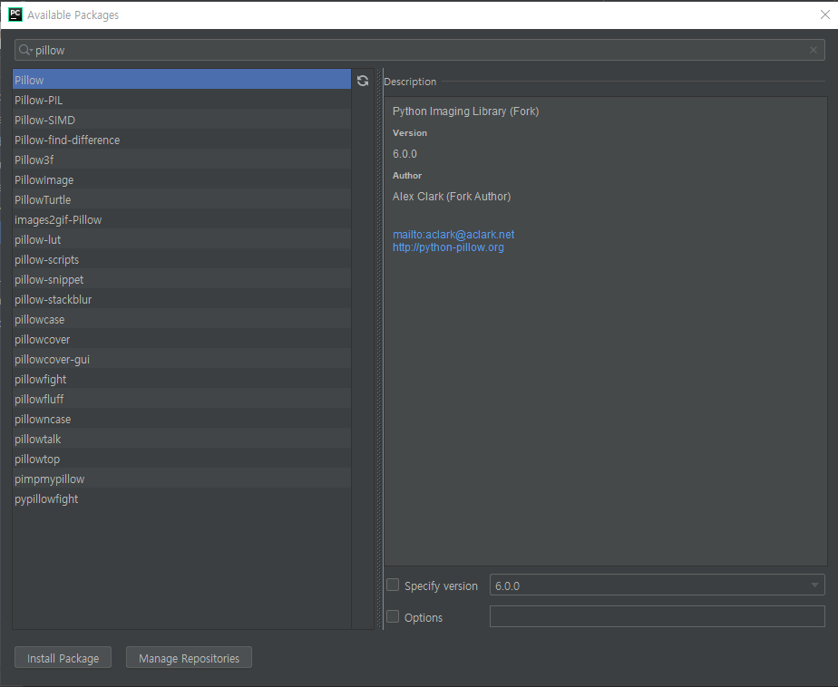

# 20190620

### Pillow library

---

### Quize 

1. Pillow를 활용한 컴퓨터 비전

---

### MISSION

1. [컴퓨터 비전(딥러닝)] - 칼라 메뉴를 가능한 부분 완성하기

   → 화소 영역처리는 실행해도 맘에 안들것임

2. [심화] 화소 영역처리 부분의 해결채? 모델 변환이 필요 HSI

3. [심화] 마우스 부분을 선택한 후에 해당 부분만 처리되기

---

Numpy 파일 입출력, 확대, 축소 수정 중

RGB 모델을 HSV모델로 변환 구현 중