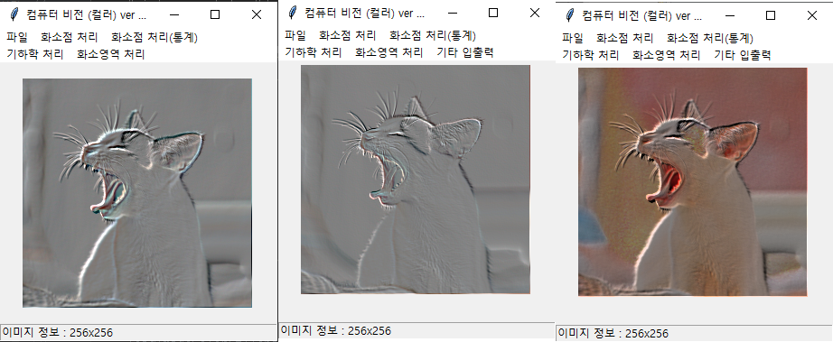

# 20190621

###  Color Image 처리를 할 때 주의해야할 것

```python
from PIL import Image, ImageFilter
def embossImagePillow() :
    global window, canvas, paper, filename, inImage, outImage, inH, inW, outH, outW
    global photo

    photo2 = photo.copy()
    photo2 = photo2.filter(ImageFilter.EMBOSS)

    outH = inH; outW = inW
    outImage = []
    for i in range(3):
        outImage.append(malloc(outH, outW))

    for i in range(outH):
        for k in range(outW):
            r, g, b = photo2.getpixel((k, i))
            outImage[R][i][k] = r;  outImage[G][i][k] = g;  outImage[B][i][k] = b
    displayImageColor()
    print("엠보싱Pillow 처리 완료")

import colorsys
def embossImageHSV() :
    global window, canvas, paper, filename, inImage, outImage, inH, inW, outH, outW
    ## 입력 RGB --> 입력 HSV
    # 메모리 확보
    inImageHSV = []
    for i in range(3):
        inImageHSV.append(malloc(outH, outW))

    # RGB → HSV
    for i in range(inH) :
        for k in range(inW) :
            r, g, b = inImage[R][i][k], inImage[G][i][k], inImage[B][i][k]
            h, s, v = colorsys.rgb_to_hsv(r/255, g/255, b/255)
            inImageHSV[0][i][k], inImageHSV[1][i][k], inImageHSV[2][i][k] = h, s, v

    outImage = [];
    for _ in range(3):
        outImage.append(malloc(outH, outW))

    ## 컴퓨터 비전 알고리즘 ##
    MSIZE = 3
    mask = [[-1, 0, 0],
            [ 0, 0, 0],
            [ 0, 0, 1]]

    ## 임시 입력 영상 메모리 확보
    tmpInImageV, tmpOutImageV = [] , []
    tmpInImageV = malloc(inH + MSIZE - 1, inW + MSIZE - 1, 127)
    tmpOutImageV = malloc(outH, outW)

    ## 원 입력 → 임시 입력
    for i in range(inH) :
        for k in range(inW) :
            tmpInImageV[i + MSIZE // 2][k + MSIZE // 2] = inImageHSV[2][i][k]

    ## 회선 연산
    for i in range(MSIZE // 2, inH + MSIZE // 2) :
        for k in range(MSIZE // 2, inW + MSIZE // 2) :
            # 각 점 처리
            S = 0.0
            for m in range(MSIZE) :
                for n in range(MSIZE) :
                    S += mask[m][n] * tmpInImageV[i + m - MSIZE // 2][k + n - MSIZE // 2]
            tmpOutImageV[i - MSIZE // 2][k - MSIZE // 2] = S * 255

    ## 127 더하기
    for i in range(outH):
        for k in range(outW):
            tmpOutImageV[i][k] += 127
            if tmpOutImageV[i][k] > 255 :
                tmpOutImageV[i][k] = 255
            elif tmpOutImageV[i][k] < 0 :
                tmpOutImageV[i][k] = 0

    # HSV → RGB
    for i in range(outH):
        for k in range(outW):
            h, s, v = inImageHSV[0][i][k], inImageHSV[1][i][k], tmpOutImageV[i][k]
            r, g, b = colorsys.hsv_to_rgb(h, s, v)
            outImage[R][i][k], outImage[G][i][k], outImage[B][i][k] = int(r), int(g), int(b)
    displayImageColor()
    print("embossImageHSV 완료")
```



1. RGB 각 채널에 emboss mask(size = 3)를 적용하여 결과 출력
2. Pillow library의 EMBOSS filter를 사용하여 결과 출력 
3. RGB 모델을 HSV모델로 변화하여 emboss mask(size=3)를 적용하여 결과 출력

1, 2는 color data 손실이 일어난 것을 볼 수 있다

---

### MISSION

1. 컴퓨터 비전(딥러닝) 칼라버전 완료
2. [심화] 추가 기능 구현하기

---

panYN → penYN으로 오타수정해야함

가로, 세로크기가 다른 사진 마스크 엠보싱 처리 시, 512X512보다 큰 사진 처리 시 버그 수정 필요

히스토그램 균일화는 영상의 밝기값에만 적용가능하고 컬러정보는 필요없다# 컬러영상을 다룰때는 YUV컬러 공간을 이용한다 Y - 밝기, U/V - 컬러. 입력영상을 YUV로 바꾸고 Y채널을 균일화 시킨뒤 다른 채널과 합한 결과를 출력

MySQL에 임시 파일을 생성하여 저장하는 기능 구현 중


* xlwt를 이용하여 xls 파일를 생성할 때 주의해야할 것

  ```python 
  ValueError: column index (256) not an int in range(256)
  ```

  index의 최대 길이는 256이다