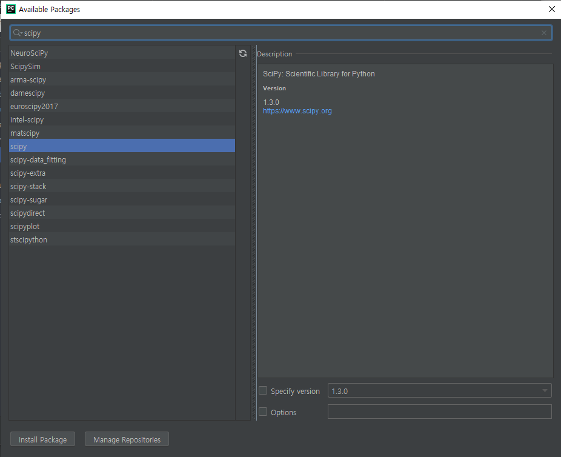
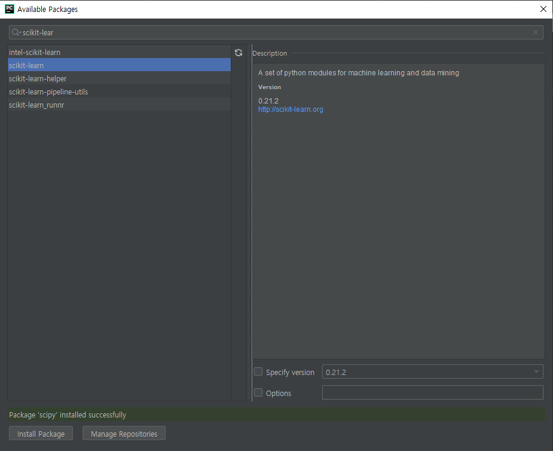
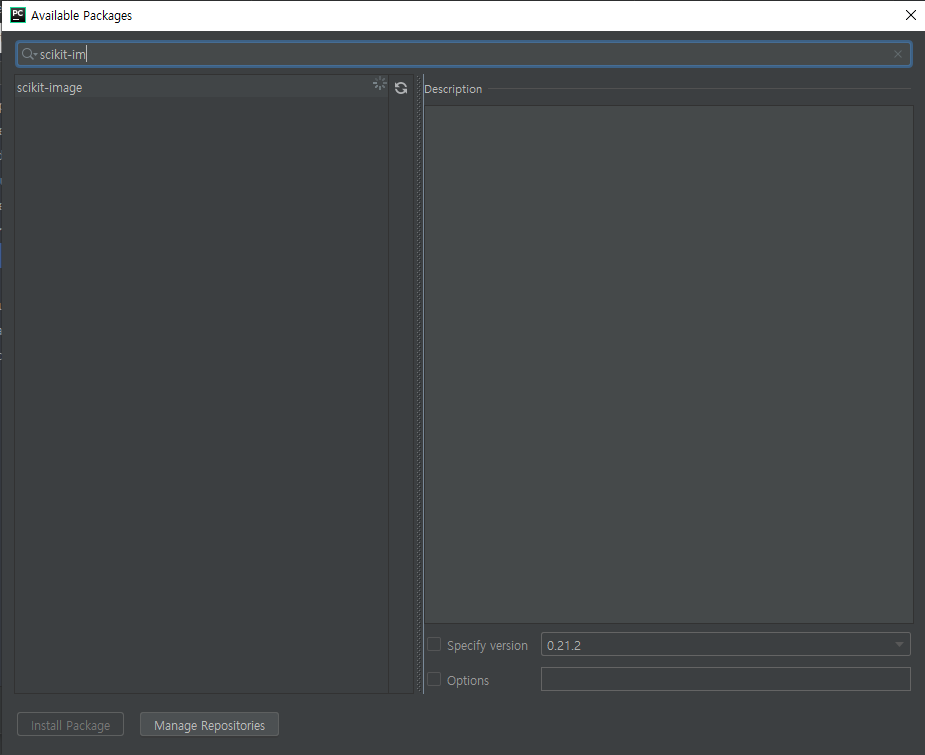

# 20190624

참고 사이트 : https://blog.naver.com/beyondlegend

* 공부 방향
  1. 인공지능 및 딥러닝 이론을 이해하고 툴을 써서 결과 도출
  2. 툴을 사용하지 않고 직접 구현

### sciket-learn







```python 
from sklearn import svm

# 1. Classifire 생성(선택) → 머신러닝 알고리즘 선택
clf = svm.SVC(gamma="auto")

# 2. 데이터로 학습 시키기
# clf.fit([훈련 데이터], [정답])
# XOR
clf.fit([[0, 0],
         [0, 1],
         [1, 0],
         [1, 1]],
        [0, 1, 1, 0])

# 3. 예측하기
# clf.predit([예측할 데이터])
result = clf.predict([[1, 0]])
print(result) # [1]
```

[[참고] scikit-learn model](https://scikit-learn.org/stable/auto_examples/classification/plot_classifier_comparison.html)

---

### Quize

1. AND 게이트 훈련 시키고 결과 출력

---

### Pandas

```python
>>> import pandas as pd
>>> df = pd.read_csv("./csv/CSV/01_data.csv")
>>> df
    Name Country  Age        Job
0   John     USA   31    Student
1  Sabre  France   33     Lawyer
2    Kim   Korea   28  Developer
3   Sato   Japan   40       Chef
4    Lee   Korea   36  Professor
5  Smith     USA   55        CEO
6  David     USA   48     Banker
>>> type(df)
<class 'pandas.core.frame.DataFrame'>
>>> sr = df.Name
>>> sr
0     John
1    Sabre
2      Kim
3     Sato
4      Lee
5    Smith
6    David
Name: Name, dtype: object
        
>>> df_Name = df.Name # 열 추출
>>> df_Name = df["Name"]
>>> df_Name
0     John
1    Sabre
2      Kim
3     Sato
4      Lee
5    Smith
6    David
Name: Name, dtype: object
>>> df_Name_Country = df[["Name", "Country"]]
>>> df_Name_Country
    Name Country
0   John     USA
1  Sabre  France
2    Kim   Korea
3   Sato   Japan
4    Lee   Korea
5  Smith     USA
6  David     USA

>>> df_row_0 = df.loc[0] # 행 추출
>>> df_row_0
Name          John
Country        USA
Age             31
Job        Student
Name: 0, dtype: object
>>> type(df_row_0)
<class 'pandas.core.series.Series'>

>>> df_row_0_3 = df.loc[[0, 3]] # list를 넘겨준다
>>> df_row_0_3
   Name Country  Age      Job
0  John     USA   31  Student
3  Sato   Japan   40     Chef
>>> type(df_row_0_3)
<class 'pandas.core.frame.DataFrame'>

>>> df_row_2to5 = df.loc[2:5] # index로 추출
>>> df_row_2to5
    Name Country  Age        Job
2    Kim   Korea   28  Developer
3   Sato   Japan   40       Chef
4    Lee   Korea   36  Professor
5  Smith     USA   55        CEO

>>> df_Con_group = df.groupby("Country")
>>> df_Con_group
<pandas.core.groupby.generic.DataFrameGroupBy object at 0x000001B9B3951A58>
>>> df_Con_group["Age"].mean()
Country
France    33.000000
Japan     40.000000
Korea     32.000000
USA       44.666667
Name: Age, dtype: float64

```

---

### MNIST

```python
from tkinter.filedialog import *
import math
import numpy as np
from sklearn import svm, metrics
from sklearn.model_selection import train_test_split
import pandas as pd
import joblib

#################
## 함수 선언부 ##
#################
def malloc(h, w, initValue = 0) :
    returnMemory = []
    for _ in range(h) :
        tmpList = []
        for _ in range(w) :
            tmpList.append(initValue)
        returnMemory.append(tmpList)
    return returnMemory

def changeValue(list):
    return [float(v) / 255 for v in list]

def studyCSV() :
    global csv, train_data, train_label, test_data, test_label, clf

    # 0. 훈련데이터, 테스트데이터 준비
    filename = askopenfilename(parent=window,
                               filetypes=(("CSV 파일", "*.csv"), ("모든 파일", "*.*")))
    if filename == None or filename == "":
        return
    csv = pd.read_csv(filename)
    train_data = csv.iloc[:, 1:].values
    train_data = list(map(changeValue, train_data))
    train_label = csv.iloc[:, 0].values

    # 1. Classifire 생성(선택) --> 머신러닝 알고리즘 선택
    clf = svm.SVC(gamma="auto")

    # 2. 데이터로 학습 시키기
    clf.fit(train_data, train_label)
    status.configure(text="TRAIN COMPLETE")

def studyDump() :
    global csv, train_data, train_label, test_data, test_label, clf
    filename = askopenfilename(parent=window,
                                filetypes=(("덤프 파일", "*.dmp;"), ("모든 파일", "*.*")))
    if filename == '' or filename == None:
        return

    clf = joblib.load(filename)
    status.configure(text="LOAD COMPLETE")

def studySave() :
    global csv, train_data, train_label, test_data, test_label, clf
    saveFp = asksaveasfile(parent=window, mode='wb',
                           defaultextension=".", filetypes=(("덤프 파일", "*.dmp;"), ("모든 파일", "*.*")))

    if saveFp == "" or saveFp == None:
        return

    # 학습된 모델 저장하기
    joblib.dump(clf, saveFp.name)
    status.configure(text="SAVE COMPLETE")

def studyScore():
    global csv, train_data, train_label, test_data, test_label, clf
    if clf == None :
        return

    filename = askopenfilename(parent=window,
                               filetypes=(("CSV 파일", "*.csv"), ("모든 파일", "*.*")))
    if filename == None or filename == "":
        return
    csv = pd.read_csv(filename)
    test_data = csv.iloc[:, 1:].values
    test_data = list(map(changeValue, test_data))
    test_label = csv.iloc[:, 0].values

    results = clf.predict(test_data)
    score = metrics.accuracy_score(results, test_label)
    status.configure(text = "정답률 : {0:.2f} %".format(score * 100))

def predictMouse() :
    global csv, train_data, train_label, test_data, test_label, clf
    global window, canvas, paper, VIEW_X, VIEW_Y, inImage, outImage, inH, inW, outH, outW
    if clf == None :
        status.configure(text = "모델을 먼저 선택하세요")
        return

    canvas = Canvas(window, height=VIEW_Y, width=VIEW_X, bg="black")
    paper = PhotoImage(height=VIEW_Y, width=VIEW_X)
    canvas.create_image((VIEW_Y // 2, VIEW_X // 2), image=paper, state='normal')
    canvas.pack(expand=1, anchor=CENTER)

    canvas.bind("<Button-3>", rightMouseClick)
    canvas.bind("<Button-2>", midMouseClick)
    canvas.bind("<Button-1>", leftMouseClick)
    canvas.bind("<B1-Motion>", leftMouseMove)
    canvas.bind("<ButtonRelease-1>", leftMouseDrop)

def rightMouseClick(event) :
    global csv, train_data, train_label, test_data, test_label, clf
    global window, canvas, paper, VIEW_X, VIEW_Y, inImage, outImage, inH, inW, outH, outW
    global leftMousePressYN

    inImage = []
    inImage = malloc(280, 280)

    # paper → inImage
    for i in range(280) :
        for k in range(280) :
            pixel = paper.get(k, i) # (r, g, b)
            if pixel[0] == 0 :
                inImage[i][k] = 0
            else :
                inImage[i][k] = 1

    # 280 → 28
    outImage = []
    outImage = malloc(28, 28)
    scale = 10

    for i in range(28):
        for k in range(28):
             outImage[i][k] = inImage[i*scale][k*scale]

    # 2차원 → 1차원
    my_data = []
    for i in range(28) :
        for k in range(28) :
            my_data.append(outImage[i][k])

    # 예측하기
    result = clf.predict([my_data])
    status.configure(text="예측 숫자 : " + str(result[0]))

def midMouseClick(event) :
    global csv, train_data, train_label, test_data, test_label, clf
    global window, canvas, paper, VIEW_X, VIEW_Y, inImage, outImage, inH, inW, outH, outW
    global leftMousePressYN

    rgbStr = ""  # 전체 픽셀의 문자열을 저장
    for i in range(280):
        tmpStr = ""
        for k in range(280):
            i = int(i); k = int(k)
            r = g = b = 0
            tmpStr += ' #%02x%02x%02x' % (r, g, b)
        rgbStr += '{' + tmpStr + '} '
    paper.put(rgbStr)

def leftMouseClick(event) :
    global leftMousePressYN
    leftMousePressYN = True

def leftMouseMove(event) :
    global csv, train_data, train_label, test_data, test_label, clf
    global window, canvas, paper, VIEW_X, VIEW_Y, inImage, outImage, inH, inW, outH, outW
    global leftMousePressYN

    if leftMousePressYN == False :
        return

    x = event.x;    y = event.y
    # 주위 40X40을 찍는다
    for i in range(-15, 15, 1) :
        for k in range(-15, 15, 1) :
            if 0 <= x+i < 280 and 0 <= y+k < 280 :
                paper.put("#%02x%02x%02x" % (255, 255, 255), (x+i, y+k))

def leftMouseDrop(event) :
    global leftMousePressYN
    leftMousePressYN = False

#####################
## 전역변수 선언부 ##
#####################
# 머신러닝 관련 전역 변수
csv, train_data, train_label, test_data, test_label, clf = [None]*6

VIEW_X, VIEW_Y = 280, 280
window, canvas, paper = [None] * 3
inImage, outImage = [], []
inH, inW, outH, outW = [0]*4

leftMousePressYN = False

#################
## 메인 코드부 ##
#################
if __name__ == '__main__':
    window = Tk()
    window.title("머신러닝 툴 (MNIST) ver 0.01")
    window.geometry("500x500")
    window.resizable(width=True, height=True)

    # 메뉴 생성
    mainMenu = Menu(window)
    window.config(menu=mainMenu)

    fileMenu = Menu(mainMenu)
    mainMenu.add_cascade(label="학습", menu=fileMenu)
    fileMenu.add_cascade(label="CSV 파일로 새로 학습", command=studyCSV)
    fileMenu.add_separator()
    fileMenu.add_cascade(label="학습모델 불러오기", command=studyDump)
    fileMenu.add_cascade(label="학습모델 저장", command=studySave)
    fileMenu.add_separator()
    fileMenu.add_cascade(label="정답률", command=studyScore)

    predictMenu = Menu(mainMenu)
    mainMenu.add_cascade(label="예측", menu=predictMenu)
    predictMenu.add_cascade(label="그림파일 불러오기", command=None)
    predictMenu.add_separator()
    predictMenu.add_cascade(label="마우스로 직접 쓰기", command=predictMouse)

    status = Label(window, text = "STATUS : ", bd = 1, relief = SUNKEN, anchor = W)
    status.pack(side = BOTTOM, fill = X)

    window.mainloop()

```


### MISSION 

1. [MNIST GUI] 완성