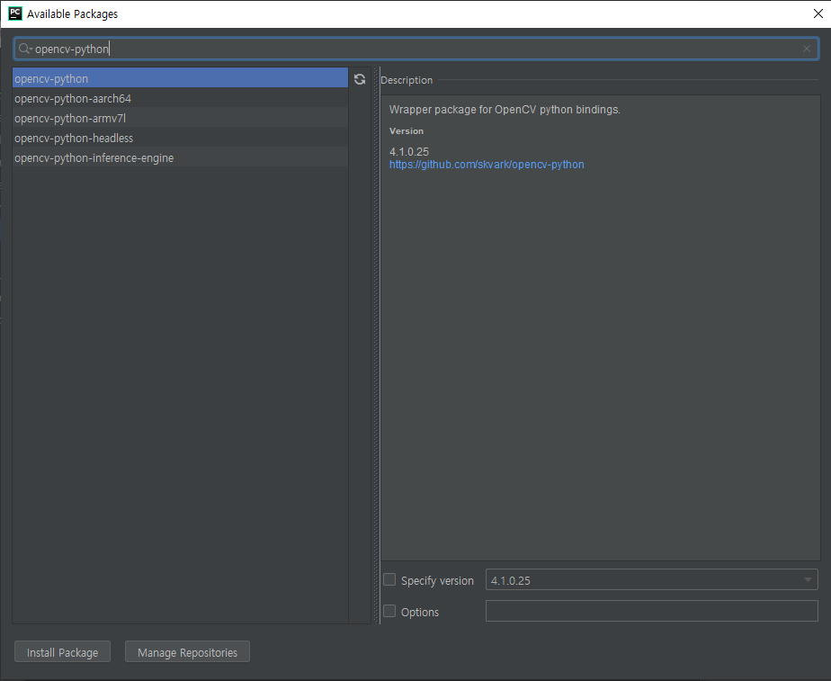

# 20190625

### OpenCV



* 주의 할 점

  ```python 
  cv2.error: OpenCV(4.1.0) : error: (-215:Assertion failed) !_src.empty() in function 'cv::cvtColor'
  ```

  OpenCV imread does not handle non-ascii characters on Windows

  ```python
  # PIL 개체 → OpenCV 개체로 복사
      if type(fnameOrCvData) == str :
          #cvData = cv2.imread(fnameOrCvData) # 파일 → CV 개체
          cvData = cv2.imdecode(np.fromfile(fnameOrCvData, dtype=np.uint8), -1)
      else :
          cvData = fnameOrCvData
  ```

  [[참고]](https://stackoverflow.com/questions/54490710/opencv-error-215assertion-failed-src-empty-in-function-cvcvtcolor)

