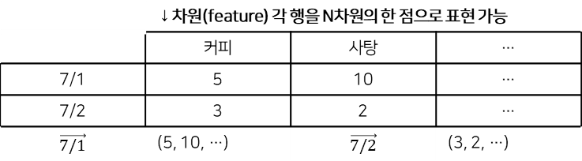
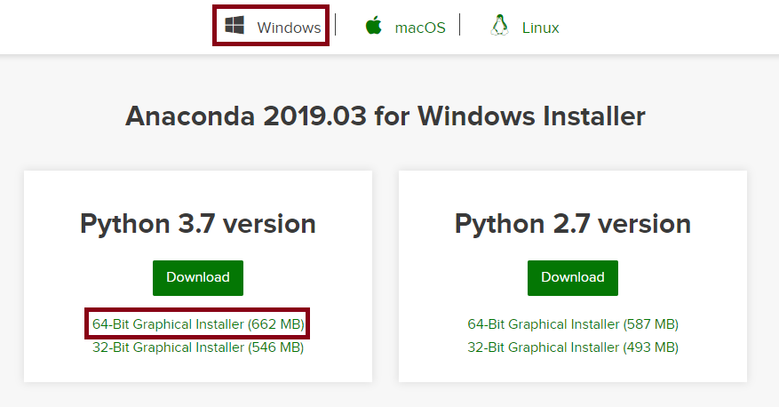
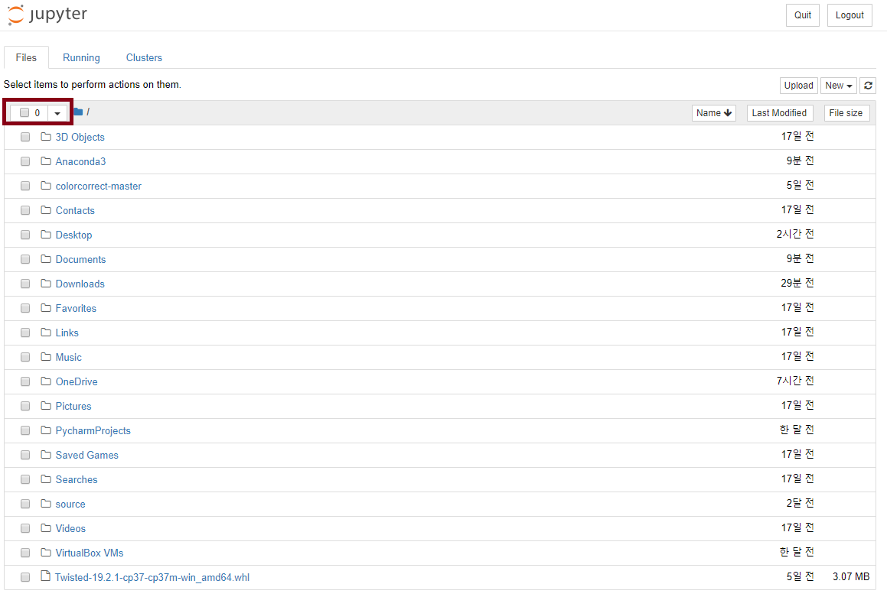
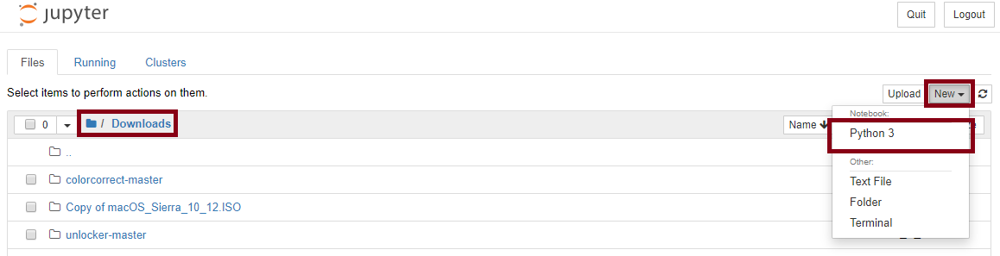
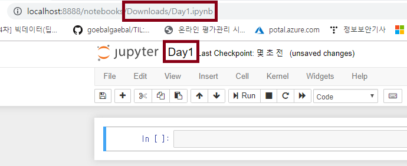
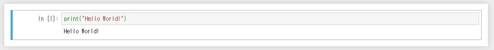
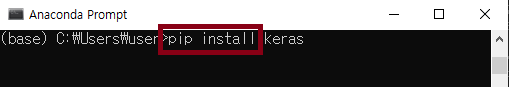
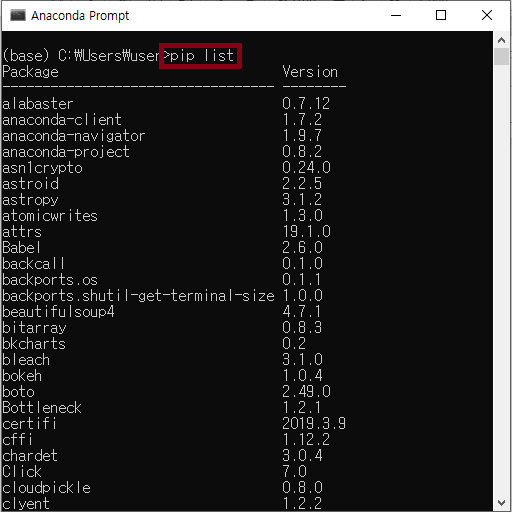
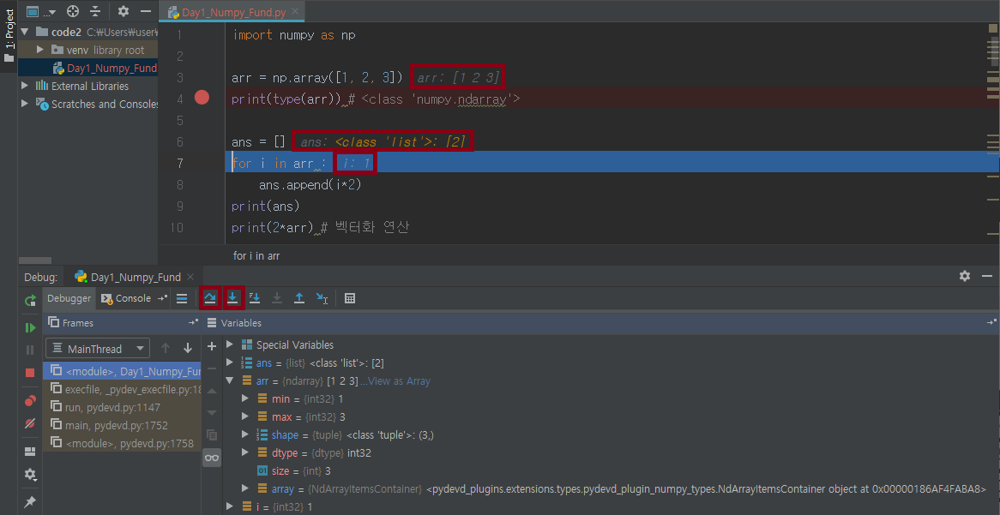

# 20190701

1. 데이터 수집 

   * 웹 → 비정형 데이터 = 텍스트, 이미지, 동영상, 음성
   * 정형데이터 → DB

2. 데이터 전처리

   1. 시각화

      * 분석 전 데이터의 형태 확인
      * matplotlib, seaborn, ...

   2. NumPy

      * 벡터화 연산 → 벡터 단위의 연산 = 속도 ↑

      * **벡터**

        저장된 순서가 의미가 있는 나열된 데이터
        
        

   3. Scikit

   2. 차원 축소
   3. 상관분석

3. 데이터분석

   1. Pandas
      * 주로 dataframe 형태

4. Machine Learning

   1-3은 데이터의 패턴을 찾아내는 작업

   1. 교사학습 : 답 O
   2. 비교사학습  : 답 X
      * GAN
   3. 강화학습

---

배열 : 모든 원소가 같은 자료형, 원소의 개수 변경 X

ndarray 지원 →  선형대수 계산 

벡터화 연산과 list연산의 구분하기

* 출력했을 때 array는 ,이  없고 list는 , 로 요소를 구분한다

---

### Numpy 기본 연산

```python 
import numpy as np

arr = np.array([1, 2, 3])
print(type(arr)) # <class 'numpy.ndarray'>

ans = []
for i in arr :
    ans.append(i*2)
print(ans)
print(2*arr) # 벡터화 연산

li = [1, 2, 3]
print(li*2) # list 2번 출력

a = np.array([1, 2])
b = np.array([10, 20])
print(3*a + b) # [13 26]


arr = np.array([1, 2, 3])
print(arr == 2) # [False  True False]
print((arr < 2) & (arr > 0)) # [ True False False]

c = np.array([[1, 2, 3], [4, 5, 6]]) # 2*3 array
print(c.shape[0], len(c)) # 행의 개수
print(c.shape[1], len(c[0])) # 열의 개수

a = np.array([1, 2, 3])
print(a.ndim) # 1
print(a.shape) # (3,)

a2 = np.array([[1, 2, 3], [4, 5, 6]])
print(a2.ndim) # 2
print(a2.shape) # (2, 3)

a = np.zeros((5, 2))
# [[0. 0.]
#  [0. 0.]
#  [0. 0.]
#  [0. 0.]
#  [0. 0.]]
a = np.zeros((5, 2), dtype="i") # dtype = "i" → integer
print(a)
# [[0 0]
#  [0 0]
#  [0 0]
#  [0 0]
#  [0 0]]

b = np.empty((5, 2)) # 쓰레기값으로 초기화된 array
print(b)

print(np.arange(10))
print(np.arange(10, 50, 3)) # 10부터 50전까지 3씩 step

# 0에서 100전까지의 구간을 5등분함
print(np.linspace(0, 100, 5)) # 선형 공간(구간)

# 0.1에서 1전까지 log 공간을 10등분함
print(np.logspace(0.1, 1, 10)) # 로그 공간(구간)

# 전치행렬
print(a)
print(a.T)

# 1차원 → 다차원
b = np.arange(12)
print(b)
# c = b.reshape(4, 3)
c = b.reshape(4, -1) #  -1로 해놓으면 남은 열을 계산해서 대입
print(c)
# [[ 0  1  2]
#  [ 3  4  5]
#  [ 6  7  8]
#  [ 9 10 11]]

# 다차원 → 1차원 : ravel, flatten
print(c)
print(c.flatten()) # [ 0  1  2  3  4  5  6  7  8  9 10 11]
print(c.ravel())

x = np.arange(5)
print(x) # [0 1 2 3 4]
x = x.reshape(5, 1)
print(x)
# [[0]
#  [1]
#  [2]
#  [3]
#  [4]]

print(x[:, np.newaxis]) # np.newaxis = 차원 증가 옵션
# [[[0]]
#  [[1]]
#  [[2]]
#  [[3]]
#  [[4]]]

# 행의 수가 동일한 2개 이상의 배열을 좌우로 연결
a1 = np.ones((2, 3))
print(a1)
# [[1. 1. 1.]
#  [1. 1. 1.]]
a2 = np.zeros((2, 2))
print(a2)
# [[0. 0.]
#  [0. 0.]]
print(np.hstack([a1, a2]))
# [[1. 1. 1. 0. 0.]
#  [1. 1. 1. 0. 0.]]
print(np.vstack([a1, a2]))
ValueError: all the input array dimensions except for the concatenation axis must match exactly

# 열의 수가 동일한 2개 이상의 배열을 상하로 연결
a2 = np.zeros((2, 3))
print(np.vstack([a1, a2]))
# [[1. 1. 1. 0. 0.]
#  [1. 1. 1. 0. 0.]]
    
  
```

---

### Anaconda 설치

가상환경의 일종

https://www.anaconda.com/distribution/





* **C:\Users\user** 가 root 폴더(0)로 잡힌다







* **Shift + Enter** 로 실행

### Anaconda에서  package 설치



### Anaconda에서 설치된 package 확인



---

### Pycharm에서 디버깅하기



1. break point 설정(line 수 옆에 클릭. 다시 한 번 클릭하면 사라짐)

2. [Run] → [Debug...]실행(Alt+Shift+F9)

3. F8(step over : 함수의 결과값만 확인), 

   F7(step onto : 함수 안으로 들어가서 실행하면서 결과 확인)을 사용해서 실행 결과 확인