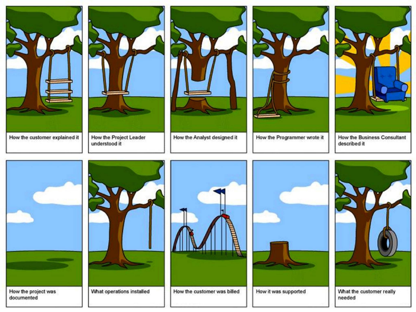

# 20190813

## 프로젝트 관리

### 프로젝트

조직 내 목표 혹은 고객과의 계약 상의 목표를 달성하기 위하여 한정된 기간과 비용 내에서 정해진 자원을 활용하여 완수하고자 하는 과제

### 수주업

고객이 발주한 사업을 타 회사들과의 경쟁을 통해 획득하고 이를 수행하는 비즈니스 행위를 영위하는 업종

1. 사업 기획 - 컨설턴트
2. 제안 - 영업
3. 계약 및 협상
4. 프로젝트 수행

* 주요 검토 사항

1. 현실적인 **수주 확도**는 어느 정도인가?

   수주를 확보할 수 있는 가능성

2. 성공적인 **수행**이 가능한가? (기술, 관리, 위험 검토)

3. 매출 규모와 **이익율**은 어느 정도인가?

4. 고객과의 **관계 유지**를 위해 전략적으로 필요한가?

### IT 프로젝트

1. 컨설팅
   * 기업의 중장기 IT 전략 수립
   * 단위 IT 프로젝트 기획
2. 시스템 구출
   * 시스템 개발, 구축 및 통합
   * 기반 인프라 구축 및 고도화
3. 운영 및 유지 보수
   * 구축된 시스템의 안정적인 운영
   * 시스템 기능/ 품질 개선 및 유지 보수

|                   |        SI        |               SM               |
| :---------------: | :--------------: | :----------------------------: |
|       업무        | 신규 시스템 구축 | 기 구축 시스템 운영/ 유지 보수 |
|      업무 량      |   비교적 많다    |          비교적 적다           |
| 기술 및 경험 정도 |   비교적 적다    |          비교적 많다           |

#### 프로젝트 규모

1. 소형 - O명 이내 수행 인원, 수행 기간 6 개월 이내 프로젝트 → 10억 미만
2. 중형 - OO명 이내 수행 인원, 수행 기간 12 개월 이내 프로젝트 → 50억 미만
3. 대형 - OOO명 이내 수행 인원, 수행 기간 2 년 이상 이내 프로젝트 → 차세대, 수천 억 규모

규모가 *작을수록* 성공 확률은 *낮아지며* 규모가 *커질수록* 성공 확률이 *현저하게 낮아짐*

##### 성공 확률

1. 범위 - 과업 내용 100% 수행
2. 일정 - 준수
3. 원가 
4. **품질**

#### 프로젝트 현실

* IT 프로젝트의 특징

  **1. 진행 상황이 가시적으로 눈에 보이지 않고 2. 개발자 의존도(각 팀원의 기술 수준, 성격 등)가 높은 속성이 존재**하기 때문에 타 업종 프로젝트보다 훨씬 관리하기가 어렵다  

  **3. 초기에 사용자 요구 사항을 명확하게 정의하기 어렵고** 요구 사항 변경에 따라 설정된 개발 범위가 프로젝트 진행 중 지속적으로 변경되고 추가되는 특징이 있다

  분석(사용자 요구 사항 확인) 

  → 설계 

  → 개발 -코딩 

  → 테스트 - 검증 = 프로젝트 후반/ 변경 사항이 생기면 다시 분석 단계로 되돌아가야 한다

  → 안정화

   

* 국내 프로젝트 주요 실패 요인

  1. 고객의 잦은 요구 변경
  2. 기술, 경험 부족 - 가격을 낮추려고 비용이 싼 업체와 계약
  3. 부정확한 기간, 비용 예측
  4. 고객, 현업의 참여 부족
  5. 영업 부서의 과욕

  

* Crunch Mode

  프로젝트의 마감 일을 앞두고 일정을 맞추기 위해 팀원들이 수면, 영향, 사회 생활, 위생 문제 등을 포기한 채 고강도 근무 체제를 유지하는 방식. 주 75 시간 이상

  

* 동서양 프로젝트의 차이

  * 서양 - 사업 목표라는 객체 중심으로 프로젝트를 인식하여 계약을 체결하고 프로젝트 수행 중 발생하는 계약 범위 밖의 요구 사항은 쉽게 거절할 수 있기 때문에 수행 및 관리가 비교적 용이
  * 동양 - 초기에 설정한 계약 상의 프로젝트 목표도 중요하지만 고객과의 관계 유지가 더 중요하기 때문에 고객의 요구에 따라 목표와 범위가 수시로 변동되어 수행 및 관리가 매우 어려움

### 프로젝트 관리의 필요성

점점 복잡해지고 많은 이슈를 내재하고 있는 프로젝트의 성공적인 수행을 위해서는 체계적인 프로젝트 관리가 필수 사항이다

1. 프로젝트 과업 범위를 보다 명확하게 정의하고 정해진 일정 내에서 가용 한 자원을 효율적으로 활용하여 목표 달성
2. 프로젝트 팀원 간의 협업 이해 관계자 간의 효과적인 의사소통 수행

### 프로젝트 관리 영역

* 목표
  1. 범위 관리
  2. 일정 관리
  3. 원가 관리
  4. 품질 관리

* 수단 
  1. **자원 관리**
  2. 의사소통 관리
  3. 위험 관리
  4. **조달 관리** - 협력 업체 선정 및 계약, 관리
  5. 이해관계자 관리

---

* 하도급 법

---

  ### 프로젝트 수행 방법론

#### 방법론 Methodology = Method + Knowledge

방법론이란 지식을 기반으로 일을 수행하는 절차, 방법, 원칙 등을 정의한 것

#### 개발 방법론

* 사용 목적 - 개발자들의 생산성 및 품질 향상

* 주 사용자 - 프로젝트 리더, 개발자

* 적용대상 - 시스템 개발 업무 - 시스템 계획, 분석, 설계, 개발, 테스트, 설치

* 주요 활동 단계 - 시스템 수명 주기에 따른 단계

* 기법 및 도구 - 각종 SW 공학적 기법: ERD, DFD 등/ 분석 지원 도구, 설계지원 도구 등

* 기대 효과 - 시스템 개발의 효율성

  

#### Waterfall 모델

요구 분석 → 설계 → 코딩 → 테스트 → 검증 등 순차적으로 개발을 진행하고 산출물 중심으로 관리하는 모델  

시스템이 구현되어 시각적으로 확인되기 전까지 고객은 요구했던 사항들의 실체를 알기 어려운 단점이 있어 잦은 변경이 발생

#### Agile 애자일 방법론

단계를 미리 예측 X, 일정한 반복 주기를 가지고 끊임없이 프로토 타입을 만들어 내며 필요할 때마다 요구 사항을 더하고 수정하여 커다란 소프트웨어를 개발해 나가는 방식  

이 과정 각각에 이해 관계자를 참여시켜 요구 사항 수집과 결과 검증을 모두 거쳐갈 수 있는 장점이 있다

 개발 단위는 동일(2 주 ~ 4 주)  

 S1(2 주) - 요구 분석 → 설계 → 코딩 → 테스트 → 검증: 1 - 10번 기능 개발  

 S2(2 주) - 요구 분석 → 설계 → 코딩 → 테스트 → 검증: 11 - 20번 기능 개발  

 S3(2 주) - 요구 분석 → 설계 → 코딩 → 테스트 → 검증: 21 - 30번 기능 개발  

 변경이 필요한 부분이나 추가되는 사항을 **다음 S**로 넘긴다   

 그리고 다음 S에서는 **우선 순위**를 정해서 우선 순위를 기준으로 개발한다

  

* 차이

  이해 관계자를 지속적으로 참여시킨다  

  우선 순위를 작성하여 상대적으로 품질을 높일 수 있다

  > 애자일은 **고객 중심**의 개발 방법론이다

  

##### 애자일 방법론을 적용하여 개발을 할 경우 고려해야 할 사항

1. 일하는 방식 차이

   기존의 일하는 방식 = peak가 한번  

   애자일 일하는 방식 = 비교적 일정한 업무량이 지속

2. 의사소통

   고객 - PM - PL - 팀원: 보고가 단계를 거쳐서 전달됨  

   애자일을 하려면 신속하게 진행해야 되므로 **보고 체제 단순화**가 필요

3. 고객 계약 상의 문제

   계약서에 필수적으로 개발할 내용 미리 명시  

   내부 개발 시에만 사용(R&D)

---

### 프로젝트 착수 단계

1. 프로젝트 리더 선임 및 팀원 별 역할 분담

   * PM

     전체 project 총괄 관리

     고객, 의사소통, 산출물 관리

     프로젝트 관리 방법론 활용

     

   * PL 

     개별 sub project 책임 

     기술 구현, 진척, 품질관리 책임

     시스템 개발 방법론 활용

2. 팀 내 협의 하에 프로젝트 ground rule 기본 규칙 정립
   1. 근무시간
   2. 일하는 방식
      * 협업
   3. 회의

### 프로젝트 계획 단계

1. 요구 사항SPEC을 분석하여 최대한 명확하도록 노력

   * 기능 구현 요구 사항
   * 품질 관련 요구 사항
   * 기타 요구 사항 

   

   

2. **WBS** *work breakdown structure* 기반으로 체계적인 공정 계획을 수립

   프로젝트 일정을 관리하기 위해  

   단계별 활동 내역을 정의한 후  

   활동 간의 선후행 관계를 고려하여   

   프로젝트 일정을 관리하는 방법  

   

3. 프로젝트 일정 계획 수립 시 고려해야 될 사항

   1. 개발 내열에 대한 기술적인 난이도 사전 평가 

   2. 업무를 담당하는 팀원 각각의 능력 고려

   3. 개발 과정에서 예상치 못한 이슈가 발생하는 경우가 많기 때문에 

   4. 이슈를 해결한 버퍼를 고려해서 일정을 계획

      → WBS 초안 작성 후 일정을 당겨 수정하여 프로젝트를 마무리 후 남은 일정 동안 문제를 해결할 수 있는 기간을 마련: **CCM** Critical Chain Method

      

   * 프로젝트 일정 지연의 심리적 요인

     학생 증후군 Student Syndrome 

     파킨슨의 법칙 Parkinson's law

### 프로젝트 완료/결과 보고서 

착수할 때 기획하고 진행 중 작성하여 종료할 때 완료(수정)하는 것 